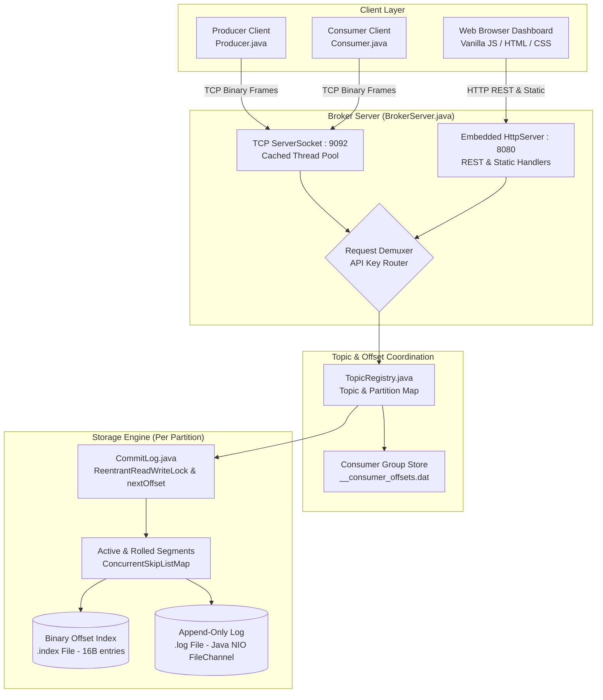

# Comprehensive Project Interview Guide: Lightweight Distributed Kafka Clone in Java

> **Document Purpose**: This guide is a complete, masterclass learning and interview preparation manual for the **Kafka Clone** project. It is written for a Java developer who understands core Java fundamentals (OOP, classes, interfaces, exceptions, collections, loops) and wants to deeply understand, articulate, and defend every single design decision, storage mechanic, networking frame, and concurrency primitive in a technical interview.

---

## Table of Contents
1. [Part 1 — Project Overview](#part-1--project-overview)
2. [Part 2 — Complete Project Folder Structure](#part-2--complete-project-folder-structure)
3. [Part 3 — File-by-File Technical Deep Dive](#part-3--file-by-file-technical-deep-dive)
   - [3.1 model/Message.java](#31-file-srcmodelmessagejava)
   - [3.2 model/Protocol.java](#32-file-srcmodelprotocoljava)
   - [3.3 storage/OffsetIndex.java](#33-file-srcstorageoffsetindexjava)
   - [3.4 storage/CommitLog.java](#34-file-srcstoragecommitlogjava)
   - [3.5 broker/TopicRegistry.java](#35-file-srcbrokertopicregistryjava)
   - [3.6 broker/BrokerServer.java](#36-file-srcbrokerbrokerserverjava)
   - [3.7 client/Producer.java](#37-file-srcclientproducerjava)
   - [3.8 client/Consumer.java](#38-file-srcclientconsumerjava)
   - [3.9 test/BrokerTest.java](#39-file-srctestbrokertestjava)
   - [3.10 Frontend & Automation Assets (web/ and scripts)](#310-frontend-and-automation-assets)
   - [3.11 Storage Engine Physical Files on Disk](#311-storage-engine-physical-files-on-disk)
4. [Part 4 — Complete Workflow from File to File](#part-4--complete-workflow-from-file-to-file)
   - [A. Application Startup Flow](#a-application-startup-flow)
   - [B. Main User Workflows](#b-main-user-workflows)
   - [C. Detailed End-to-End Execution Trace](#c-detailed-end-to-end-execution-trace)
   - [D. Error Handling & Edge Cases](#d-error-handling--edge-cases)
5. [Part 5 — Overall Architecture](#part-5--overall-architecture)
6. [Part 6 — Technologies & Frameworks](#part-6--technologies--frameworks)
7. [Part 7 — Storage Engine Mechanics (The "Database")](#part-7--storage-engine-mechanics-the-database)
8. [Part 8 — API & Wire Protocol Specification](#part-8--api--wire-protocol-specification)
9. [Part 9 — Java Concepts Mapped to Project Code](#part-9--java-concepts-mapped-to-project-code)
10. [Part 10 — Security Analysis](#part-10--security-analysis)
11. [Part 11 — Configuration & Dependencies](#part-11--configuration--dependencies)
12. [Part 12 — Testing & Verification](#part-12--testing--verification)
13. [Part 13 — Complete Interview Question Bank](#part-13--complete-interview-question-bank)
    - [A. Basic Questions (15 Questions)](#a-basic-questions)
    - [B. Architecture Questions (15 Questions)](#b-architecture-questions)
    - [C. Java Language Questions (20 Questions)](#c-java-language-questions)
    - [D. Networking & Concurrency Questions (15 Questions)](#d-networking--concurrency-questions)
    - [E. Storage Engine Questions (10 Questions)](#e-storage-engine-questions)
    - [F. Scenario-Based & System Design Questions (15 Questions)](#f-scenario-based--system-design-questions)
14. [Part 14 — Interview-Ready Project Pitch (30s, 2m, 5m)](#part-14--interview-ready-project-pitch)
15. [Part 15 — Step-by-Step Learning Roadmap](#part-15--step-by-step-learning-roadmap)
16. [Part 16 — Final Cheat Sheet](#part-16--final-cheat-sheet)

---

# Part 1 — Project Overview

### 1. What is this project?
This project is a **custom, lightweight, distributed message broker implemented from scratch in pure Java (SE 21) with zero external third-party dependencies**. It replicates the core architecture and fundamental mechanics of **Apache Kafka**, including an append-only segmented commit log storage engine, binary offset indexing, length-prefixed binary TCP wire protocol, consumer group offset coordination, crash recovery, client SDKs (Producer and Consumer), an embedded zero-dependency HTTP REST API, and a live web dashboard.

### 2. What problem does it solve?
Traditional message queues (like RabbitMQ or Amazon SQS) operate on **destructive reads**: when a consumer reads a message, the broker deletes it. This creates major problems:
- **No Event Replay**: Historical data cannot be re-consumed by new services or during bug investigations.
- **Random Disk I/O Bottlenecks**: Relational databases or B-Tree indexes use random read/write disk seeks, which slow down under heavy write traffic.
- **Expensive Fan-Out**: Serving the same message stream to 10 independent microservices requires 10 distinct copies of queues.

This project solves these problems using **Kafka's append-only commit log model**:
- Messages are written sequentially to immutable disk logs and are **never deleted upon consumption**.
- Multiple consumers track their own read pointers (offsets) independently.
- Any consumer can replay historical events from offset `0` at any time without impacting other consumers or disk performance.

### 3. What is the purpose of the application?
1. To demonstrate how high-throughput messaging engines achieve $O(1)$ disk writes through sequential I/O.
2. To demonstrate binary protocol framing over persistent raw TCP sockets without third-party frameworks like Netty or Spring Boot.
3. To provide a complete working message streaming platform with zero setup overhead (`javac` + `java`), featuring visual log segment inspection and live traffic simulation.

### 4. Who uses it?
- **Backend microservices**: Services communicating asynchronously via event streaming (e.g., an Order Service publishing events and an Inventory Service consuming them).
- **Developers & Students**: Anyone studying distributed systems internals, disk page caches, binary protocols, and concurrent lock management.

### 5. What are its main features?
1. **Append-Only Commit Log**: Sequential disk writes using Java NIO `FileChannel`.
2. **Binary Offset Indexing (`.index`)**: $O(\log N)$ floor offset lookup via 16-byte binary index records mapping logical offsets to physical log byte positions.
3. **Log Segment Rolling**: Automatically rolls `.log` files when segments exceed threshold size (e.g. 1MB default, configurable).
4. **Length-Prefixed Binary Wire Protocol**: High-performance socket framing with API keys, versioning, correlation IDs, and payload delimitation.
5. **CRC32 Data Integrity**: End-to-end checksum calculation protecting against bit-rot and network/disk corruption.
6. **Consumer Group Offset Management**: Server-side offset tracking persisted to `__consumer_offsets.dat` using atomic file replacement.
7. **Crash Recovery**: Auto-recovery on reboot by scanning existing directory trees and restoring high watermarks.
8. **Partition Routing**: Key-based hash partitioning ensuring total ordering per business entity key.
9. **Zero-Dependency Embedded HTTP Server & REST API**: Native Java `HttpServer` serving a live Neo-Brutalist dashboard.
10. **Visual Storage Inspector**: Web-based real-time inspector showing segment files, byte positions, and binary payload decoding.

### 6. What technologies and frameworks are used?
- **Core Language**: Java Standard Edition (SE) 21.
- **I/O & Storage**: Java NIO (`FileChannel`, `ByteBuffer`, `RandomAccessFile`).
- **Networking**: Java Core Networking (`ServerSocket`, `Socket`, `BufferedInputStream`, `BufferedOutputStream`).
- **Concurrency**: `java.util.concurrent` (`ReentrantReadWriteLock`, `AtomicLong`, `AtomicInteger`, `ConcurrentHashMap`, `ConcurrentSkipListMap`, `Executors.newCachedThreadPool`).
- **Data Integrity**: `java.util.zip.CRC32`.
- **Embedded Web Server**: `com.sun.net.httpserver.HttpServer` (built directly into the JDK).
- **Frontend Dashboard**: Vanilla HTML5, Vanilla CSS3 (custom Neo-Brutalist theme), Vanilla JavaScript (ES6+ `fetch`, DOM manipulation, CSS grid/flexbox). Zero NPM packages.
- **Build System**: Direct command-line tooling (`javac`, `java`, PowerShell script `start.bat`, Shell script `start.sh`).

### 7. Why is each technology used?
| Technology | Why It Was Chosen |
| :--- | :--- |
| **Pure Java (Zero Dependencies)** | Eliminates dependency bloat and exposes raw OS-level primitives (file descriptors, sockets, thread scheduling). Proves architectural understanding from first principles. |
| **Java NIO `FileChannel` & `ByteBuffer`** | Enables direct, unbuffered sequential disk writes that leverage the OS Page Cache for near-memory speeds ($O(1)$). |
| **`ConcurrentSkipListMap`** | Provides thread-safe, sorted, logarithmic ($O(\log N)$) floor lookups (`floorEntry()`) for finding index offsets without manual binary search logic. |
| **`ReentrantReadWriteLock`** | Permits unlimited concurrent reader threads (`readLock`) while maintaining exclusive access for message appends (`writeLock`). |
| **`AtomicLong` / `AtomicInteger`** | Provides lock-free, thread-safe monotonic incrementing for offset assignment and correlation IDs. |
| **`com.sun.net.httpserver.HttpServer`** | Provides a lightweight HTTP server out of the box without requiring Spring Boot or Tomcat. |
| **Vanilla Frontend** | Allows the dashboard to be served directly from disk by the embedded server without Node.js or Webpack builds. |

### 8. Application Classification
It is a **distributed backend message broker infrastructure system** coupled with a **lightweight embedded administration web application**. It contains a server engine, client SDKs (Producer and Consumer), and a web UI.

### 9. Overall Architecture Summary
```
+-----------------------------------------------------------------------------------+
|                                  CLIENT LAYER                                     |
|   +--------------------------+                         +----------------------+   |
|   |  Java Producer Client    |                         | Java Consumer Client |   |
|   +------------+-------------+                         +-----------^----------+   |
|                |                                                   |              |
+----------------|---------------------------------------------------|--------------+
                 | TCP Port 9092 (Binary Wire Protocol)              |
+----------------v---------------------------------------------------+--------------+
|                            BROKER SERVER (BrokerServer.java)                      |
|  - ServerSocket (Port 9092) -> Worker ThreadPool                                  |
|  - Request Demuxer (API_PRODUCE, API_FETCH, API_METADATA, OFFSET_COMMIT/FETCH)    |
|  - Embedded HTTP Server (Port 8080) -> REST Endpoints & Web Dashboard Assets      |
+----------------------------------------+------------------------------------------+
                                         |
+----------------------------------------v------------------------------------------+
|                             TOPIC REGISTRY (TopicRegistry.java)                   |
|  - Partition routing & Topic metadata                                             |
|  - Consumer group offset coordinator (__consumer_offsets.dat)                     |
+----------------------------------------+------------------------------------------+
                                         |
+----------------------------------------v------------------------------------------+
|                        PARTITION COMMIT LOG (CommitLog.java)                      |
|  - ReentrantReadWriteLock (Partition Concurrency)                                 |
|  - AtomicLong nextOffset (Monotonic Offset Counter)                               |
|  - Active & Inactive Segments (ConcurrentSkipListMap<Long, Segment>)              |
+--------------------+---------------------------------------+----------------------+
                     |                                       |
+--------------------v-------------------+   +---------------v----------------------+
|       LOG FILE (.log)                  |   |      OFFSET INDEX FILE (.index)      |
|  - Append-only binary message records  |   |  - Fixed 16-byte records             |
|  - Offset | Ts | Key | Value | CRC32   |   |  - [8B Offset] -> [8B File Position] |
+----------------------------------------+   +--------------------------------------+
```

### 10. What happens when the application starts?
1. The process entry point (`BrokerServer.main()`) parses command-line arguments (default: TCP 9092, HTTP 8080, `./kafka_data`).
2. It initializes `TopicRegistry`, which scans `./kafka_data` for existing topic and partition directories.
3. For every partition found, it constructs a `CommitLog` which scans existing `.log` and `.index` files to restore the partition's active segment and high watermark offset.
4. `TopicRegistry` reads `__consumer_offsets.dat` to restore committed offsets for all consumer groups.
5. A TCP `ServerSocket` binds to port `9092` and starts an accept loop on a background thread.
6. An embedded HTTP `HttpServer` binds to port `8080` and registers REST and static file handlers.
7. The broker begins accepting socket connections and HTTP dashboard traffic.

---

### Interview-Ready Pitch: "Tell me about your project"
> "I built a lightweight distributed message broker in pure Java SE 21 from first principles, mirroring Apache Kafka's core architectural design. The project implements an append-only segmented commit log storage engine using Java NIO `FileChannel` for sequential $O(1)$ disk writes, paired with binary `.index` files that give $O(\log N)$ floor offset seeking. I built a custom length-prefixed binary wire protocol with CRC32 integrity verification over persistent raw TCP sockets, complete with Java Producer and Consumer client SDKs. It also features server-side consumer group offset management with atomic file persistence, crash recovery on reboot, and an embedded zero-dependency HTTP web dashboard with an interactive storage inspector. Building it entirely without external frameworks gave me a deep understanding of low-level concurrency, disk page caches, binary serialization, and socket programming."

---

# Part 2 — Complete Project Folder Structure

```text
kafka-clone/
├── .gitignore                          <-- Git ignore patterns (ignores /bin, /test_data, IDE files)
├── start.bat                           <-- Windows startup script (compiles & runs BrokerServer)
├── start.sh                            <-- Unix/macOS/Linux startup script
├── README.md                           <-- High-level project documentation & quickstart
├── MANUAL_TESTING_GUIDE.md             <-- Operational runbook for terminal, curl, and UI testing
├── docs/
│   └── ARCHITECTURE_AND_PIPELINE.md   <-- Deep technical documentation of pipelines & storage engine
├── src/
│   ├── model/
│   │   ├── Message.java                <-- Immutable message record with CRC32 calculation
│   │   └── Protocol.java               <-- Wire protocol framing, codec, requests, responses, error codes
│   ├── storage/
│   │   ├── OffsetIndex.java            <-- Fixed 16-byte binary index file manager (.index)
│   │   └── CommitLog.java              <-- Segmented append-only log engine (.log) & recovery
│   ├── broker/
│   │   ├── TopicRegistry.java          <-- Partition lifecycle & consumer group offset persistence
│   │   └── BrokerServer.java           <-- Main server: TCP socket loop, protocol demuxer & HTTP dashboard
│   ├── client/
│   │   ├── Producer.java               <-- Thread-safe TCP client with key hashing & ACK handling
│   │   └── Consumer.java               <-- Sequential TCP client with poll loop & offset commit/seek
│   └── test/
│       └── BrokerTest.java             <-- Standalone automated integration and crash-recovery test suite
├── web/
│   ├── index.html                      <-- Neo-Brutalist dashboard markup
│   ├── style.css                       <-- Design system tokens, layouts, and animations
│   └── app.js                          <-- Dashboard logic, API calls, and pipeline explainer
└── kafka_data/                         <-- Default directory for active broker storage on disk
    ├── __consumer_offsets.dat          <-- Server-side consumer group committed offset key-value store
    └── orders/                         <-- Example topic folder
        ├── partition-0/
        │   ├── 00000000000000000000.log    <-- Binary append-only message log
        │   └── 00000000000000000000.index  <-- Binary offset-to-position index
        ├── partition-1/
        └── partition-2/
```

### Folder Roles and Connections
- **`src/model/`**: Contains the data structures representing messages and wire protocol packets. It has no dependencies on storage or networking. Used by all layers (broker, storage, and clients).
- **`src/storage/`**: The low-level disk I/O engine. Directly interacts with the file system using Java NIO. Consumes models from `model/`.
- **`src/broker/`**: The central coordinator. Manages multiple topics, routes requests to specific `CommitLog` instances, and handles TCP/HTTP networking.
- **`src/client/`**: Independent client SDKs providing idiomatic `send()` and `poll()` APIs for application developers. Connects to `broker/` exclusively over TCP sockets.
- **`src/test/`**: Integration test harness verifying end-to-end functionality, data consistency, and crash recovery.
- **`web/`**: Single-page application (SPA) dashboard served by `BrokerServer` to visualize the broker state.
- **`kafka_data/`**: The runtime database directory where all physical `.log`, `.index`, and offset files live.

---

# Part 3 — File-by-File Technical Deep Dive

---

## 3.1 File: `src/model/Message.java`

### 1. Purpose
Defines the in-memory and on-disk representation of an individual message unit, along with CRC32 checksum computation for data corruption detection.

### 2. Real-World Representation
Represents an individual event or record (e.g., `"Order #1029 placed by User 44"`).

### 3. Key Code Snippet
```java
public class Message {
    private final long offset;
    private final long timestamp;
    private final byte[] key;
    private final byte[] value;
    private final long crc;

    public static Message of(String key, String value) {
        byte[] k = (key != null) ? key.getBytes(StandardCharsets.UTF_8) : null;
        byte[] v = (value != null) ? value.getBytes(StandardCharsets.UTF_8) : new byte[0];
        long now = System.currentTimeMillis();
        long calculatedCrc = computeChecksum(now, k, v);
        return new Message(-1L, now, k, v, calculatedCrc);
    }
}
```

### 4. Line-by-Line Breakdown
- `private final long offset;`: The unique, monotonically increasing 64-bit sequence number assigned by the partition log. Set to `-1L` before append.
- `private final long timestamp;`: Milliseconds since Unix epoch (`System.currentTimeMillis()`).
- `private final byte[] key;`: Optional routing key used to determine partition assignment. Can be `null`.
- `private final byte[] value;`: The payload (data) of the message.
- `private final long crc;`: 32-bit CRC checksum stored as an unsigned value in a Java 64-bit `long`.
- `computeChecksum(...)`: Creates a `java.util.zip.CRC32` object, feeds the 8 bytes of the timestamp, then the key bytes, then the value bytes, and returns `crc32.getValue()`.

### 5. Important Methods
| Method | Parameters | Return Type | What It Does | Caller | Callee |
| :--- | :--- | :--- | :--- | :--- | :--- |
| `of(String, String)` | `String key, String value` | `Message` | Factory method creating uncommitted message (`offset = -1`). | `Producer.send()`, `BrokerServer.handleApiProduce()` | `computeChecksum()` |
| `withOffset(long)` | `long assignedOffset` | `Message` | Clones message with assigned sequence offset. | `CommitLog.append()` | `new Message()` |
| `computeChecksum(...)` | `long ts, byte[] k, byte[] v` | `long` | Calculates CRC32 over timestamp, key, and value. | `of()`, `isChecksumValid()` | `CRC32.update()` |
| `isChecksumValid()` | None | `boolean` | Checks if stored CRC matches newly recomputed CRC. | `Consumer.poll()`, `BrokerTest` | `computeChecksum()` |

### 6. Dependencies
- Imports `java.nio.charset.StandardCharsets` for UTF-8 conversions and `java.util.zip.CRC32` for hardware-accelerated checksum calculation. Zero external libraries.

### 7. Interview Questions & Answers
- **Q: Why is `Message` immutable (all fields `final`)?**
  *Answer*: Immutability makes `Message` instances inherently thread-safe. They can be shared across producer threads, network buffers, and reader threads without synchronization or defensive copying.
- **Q: Why calculate CRC32 on the message?**
  *Answer*: In distributed streaming, messages pass through network cards, operating system page caches, and physical disk sectors. Bit-flips or truncated writes can cause silent data corruption. CRC32 ensures that any single-bit alteration is caught during retrieval.

### 8. One-Line Summary
The immutable data unit representing a message, carrying offset, timestamp, key, value, and a CRC32 integrity checksum.

---

## 3.2 File: `src/model/Protocol.java`

### 1. Purpose
The wire framing and serialization codec. Defines the binary structure of packets over TCP, request/response models, API keys, and error codes.

### 2. Real-World Representation
The common "language" spoken between the broker and clients across the TCP socket.

### 3. Key Code Snippet
```java
// Wire Framing: [4-byte total payload length] [payload]
public static byte[] readFrame(InputStream in) throws IOException {
    DataInputStream dis = new DataInputStream(in);
    int length;
    try {
        length = dis.readInt();
    } catch (EOFException e) {
        return null; // Graceful disconnect
    }
    if (length <= 0 || length > 32 * 1024 * 1024) { // 32MB guard
        throw new IOException("Invalid frame length: " + length);
    }
    byte[] payload = new byte[length];
    dis.readFully(payload);
    return payload;
}
```

### 4. Line-by-Line Breakdown
- `API_PRODUCE = 1, API_FETCH = 2, API_METADATA = 3, API_OFFSET_COMMIT = 4, API_OFFSET_FETCH = 5`: Numeric identifiers indicating the operation type.
- `ErrorCode`: Enum mapping short values to status descriptions (`NONE=0`, `UNKNOWN_TOPIC=1`, `OFFSET_OUT_OF_BOUNDS=2`, `CORRUPT_MESSAGE=3`, `UNKNOWN_PARTITION=4`, `SERVER_ERROR=5`).
- `readFrame(InputStream)`: Solves TCP packet fragmentation. It reads a 4-byte integer length prefix, enforces a 32MB safety bound, and uses `dis.readFully()` to block until all bytes of the frame have arrived.
- `serializeMessage(Message)`: Converts a `Message` into a compact binary byte array for disk storage and network transmission:
  `[8B offset][8B timestamp][4B key length][key bytes][4B val length][val bytes][4B crc]`.

### 5. Important Methods
| Method | Parameters | Return Type | What It Does | Caller | Callee |
| :--- | :--- | :--- | :--- | :--- | :--- |
| `readFrame(InputStream)` | `InputStream in` | `byte[]` | Reads a length-prefixed TCP frame. | `BrokerServer.handleClientSocket()`, `Producer`, `Consumer` | `DataInputStream.readInt()`, `readFully()` |
| `writeFrame(OutputStream, byte[])` | `OutputStream, byte[]` | `void` | Writes 4-byte length followed by payload. | `BrokerServer`, `Producer`, `Consumer` | `DataOutputStream.writeInt()`, `flush()` |
| `serializeMessage(Message)` | `Message msg` | `byte[]` | Serializes message to binary format. | `CommitLog.Segment.append()`, `encodeProduceRequest()` | `ByteBuffer.put*()` |
| `deserializeMessage(ByteBuffer)` | `ByteBuffer buf` | `Message` | Reconstructs message from bytes. | `CommitLog.Segment.read()`, `decodeProduceRequest()` | `ByteBuffer.get*()` |

### 6. Dependencies
- Uses Java Standard I/O (`DataInputStream`, `DataOutputStream`, `ByteArrayInputStream`, `ByteArrayOutputStream`) and NIO `ByteBuffer`.

### 7. Interview Questions & Answers
- **Q: What problem does `readFrame` solve in TCP?**
  *Answer*: TCP is a stream-oriented protocol, not a message-oriented protocol. Data sent in two separate `write()` calls may arrive merged in a single packet, or a single message may arrive split across multiple TCP segments. The 4-byte length prefix acts as a delimiter, allowing the receiver to buffer and parse exact frame boundaries.
- **Q: Why is there a 32MB guard in `readFrame`?**
  *Answer*: To prevent denial-of-service and `OutOfMemoryError` attacks. If an attacker sends a corrupted frame header claiming a length of 2GB, the broker would attempt to allocate `new byte[2147483647]`, crashing the JVM.

### 8. One-Line Summary
The binary protocol codec that encodes, decodes, and frames all messages and RPC requests over TCP.

---

## 3.3 File: `src/storage/OffsetIndex.java`

### 1. Purpose
Manages the binary index file (`.index`) for a partition segment. Maps logical 64-bit message offsets to their physical 64-bit byte offsets in the corresponding `.log` file.

### 2. Real-World Representation
A physical index, similar to an index at the back of a textbook, allowing direct jumps to a specific page rather than scanning the book from page 1.

### 3. Key Code Snippet
```java
public class OffsetIndex implements Closeable {
    public static final int ENTRY_SIZE = 16; // 8 bytes offset + 8 bytes position
    private final ConcurrentSkipListMap<Long, Long> inMemoryMap = new ConcurrentSkipListMap<>();

    public synchronized void append(long offset, long position) throws IOException {
        inMemoryMap.put(offset, position);
        ByteBuffer buf = ByteBuffer.allocate(ENTRY_SIZE);
        buf.putLong(offset);
        buf.putLong(position);
        buf.flip();

        channel.position(entriesCount * ENTRY_SIZE);
        while (buf.hasRemaining()) {
            channel.write(buf);
        }
        entriesCount++;
    }

    public long lookup(long targetOffset) {
        Map.Entry<Long, Long> entry = inMemoryMap.floorEntry(targetOffset);
        return (entry != null) ? entry.getValue() : 0L;
    }
}
```

### 4. Line-by-Line Breakdown
- `ENTRY_SIZE = 16`: Every entry on disk is strictly 16 bytes: 8 bytes for message offset (`long`) and 8 bytes for physical byte offset (`long`).
- `ConcurrentSkipListMap<Long, Long> inMemoryMap`: In-memory sorted map providing $O(\log N)$ concurrent floor lookups.
- `append(long offset, long position)`: Synchronized method. Updates the in-memory map, formats the 16-byte binary entry, seeks the `FileChannel` to the end of the index file, and writes the bytes.
- `lookup(long targetOffset)`: Calls `inMemoryMap.floorEntry(targetOffset)` to find the greatest indexed offset less than or equal to the target offset. Returns the byte position. If no entry exists, returns `0L`.

### 5. Important Methods
| Method | Parameters | Return Type | What It Does | Caller | Callee |
| :--- | :--- | :--- | :--- | :--- | :--- |
| `append(long, long)` | `long offset, long position` | `void` | Appends index entry to memory and disk. | `CommitLog.Segment.append()` | `FileChannel.write()` |
| `lookup(long)` | `long targetOffset` | `long` | Finds physical byte position in log for offset. | `CommitLog.Segment.read()` | `ConcurrentSkipListMap.floorEntry()` |
| `loadExisting()` | None | `void` | Reads disk `.index` file into memory on startup. | `OffsetIndex` constructor | `FileChannel.read()` |
| `flush()` | None | `void` | Forces unwritten buffers to disk (`channel.force(true)`). | `close()`, `CommitLog.Segment.flush()` | `FileChannel.force()` |

### 6. Dependencies
- Java NIO (`FileChannel`, `ByteBuffer`), `RandomAccessFile`, and `ConcurrentSkipListMap`.

### 7. Interview Questions & Answers
- **Q: Why does `lookup()` use a floor entry instead of an exact match?**
  *Answer*: In sparse indexing, not every message offset has an index entry. A floor lookup finds the closest preceding indexed offset $\le$ target. The broker jumps to that physical byte position and scans forward sequentially through a small number of records to find the exact offset, saving significant index memory.
- **Q: Why is each entry fixed at 16 bytes?**
  *Answer*: Fixed-width records allow binary search directly on disk without delimiters. Position $K$ is always at byte $K \times 16$.

### 8. One-Line Summary
A binary index providing $O(\log N)$ lookups from message offset to physical file byte position.

---

## 3.4 File: `src/storage/CommitLog.java`

### 1. Purpose
The core storage engine for an individual partition. Implements an append-only commit log with segment file rolling, reading with bounds, and crash recovery.

### 2. Real-World Representation
The ledger of a partition where events are permanently and immutably written in order.

### 3. Key Code Snippet
```java
public class CommitLog implements Closeable {
    private final ConcurrentSkipListMap<Long, Segment> segments = new ConcurrentSkipListMap<>();
    private final AtomicLong nextOffset = new AtomicLong(0L);
    private final ReentrantReadWriteLock rwLock = new ReentrantReadWriteLock();
    private Segment activeSegment;

    public long append(List<Message> messages) throws IOException {
        rwLock.writeLock().lock();
        try {
            long baseOffset = nextOffset.get();
            for (Message original : messages) {
                if (activeSegment.getCurrentSize() >= maxSegmentBytes) {
                    roll(nextOffset.get());
                }
                long assignedOffset = nextOffset.getAndIncrement();
                Message msgWithOffset = original.withOffset(assignedOffset);
                activeSegment.append(msgWithOffset);
            }
            activeSegment.flush();
            return baseOffset;
        } finally {
            rwLock.writeLock().unlock();
        }
    }
}
```

### 4. Line-by-Line Breakdown
- `AtomicLong nextOffset`: The high watermark counter holding the next available monotonic offset.
- `ReentrantReadWriteLock rwLock`: Read-write lock enabling high concurrency: unlimited concurrent consumer reads (`readLock()`) and strictly serialized appends (`writeLock()`).
- `Segment` inner class: Represents a paired `00000000000000000000.log` and `00000000000000000000.index` file on disk.
- `roll(long newBaseOffset)`: Flushes the old active segment, creates a new segment file prefixed with the 20-digit zero-padded base offset, and registers it in `segments`.
- `recoverAndInitialize()`: Scans all `.log` files in the partition directory, parses the last segment, and sets `nextOffset` to `highestOffset + 1`.

### 5. Important Methods
| Method | Parameters | Return Type | What It Does | Caller | Callee |
| :--- | :--- | :--- | :--- | :--- | :--- |
| `append(List<Message>)` | `List<Message>` | `long` | Assigns monotonic offsets, writes to `.log` and `.index`, rolls if needed. | `BrokerServer.handleProduce()` | `Segment.append()`, `roll()` |
| `read(long, int, int)` | `long startOffset, int maxMsgs, int maxBytes` | `List<Message>` | Reads messages starting from `startOffset`. | `BrokerServer.handleFetch()` | `Segment.read()` |
| `recoverAndInitialize()` | None | `void` | Discovers existing segments and restores high watermark. | Constructor | `Segment.read()` |
| `roll(long)` | `long newBaseOffset` | `void` | Closes active segment and opens a new active segment. | `append()`, `recoverAndInitialize()` | `new Segment()` |

### 6. Dependencies
- Uses `storage.OffsetIndex`, `model.Message`, `model.Protocol`, Java NIO channels, and concurrency locks.

### 7. Interview Questions & Answers
- **Q: Why does `CommitLog` break logs into segments instead of using one giant file?**
  *Answer*: Segmenting files prevents files from exceeding operating system file size limits and enables log retention/cleanup. Old segments that exceed a retention period can be deleted with a single $O(1)$ file deletion instead of expensive disk rewriting.
- **Q: How does `CommitLog` handle concurrent reads and writes?**
  *Answer*: It uses a `ReentrantReadWriteLock`. Multiple consumer threads can acquire the `readLock()` simultaneously and read from different segments without blocking. When a producer appends, it acquires the `writeLock()`, ensuring thread-safe monotonic offset increments and append ordering.

### 8. One-Line Summary
The partition storage engine managing append-only log segments, indexing, concurrency locks, and crash recovery.

---

## 3.5 File: `src/broker/TopicRegistry.java`

### 1. Purpose
Tracks all active topics, their partition lists, and manages consumer group committed offsets with persistent disk storage in `__consumer_offsets.dat`.

### 2. Real-World Representation
The central broker coordinator and directory of topics, partitions, and consumer progress.

### 3. Key Code Snippet
```java
private synchronized void saveCommittedOffsets() throws IOException {
    File tempFile = new File(dataDir, "__consumer_offsets.tmp");
    try (PrintWriter writer = new PrintWriter(new OutputStreamWriter(
            new FileOutputStream(tempFile), StandardCharsets.UTF_8))) {
        for (Map.Entry<String, Long> entry : committedOffsets.entrySet()) {
            writer.println(entry.getKey() + "=" + entry.getValue());
        }
    }
    if (offsetsFile.exists()) {
        offsetsFile.delete();
    }
    tempFile.renameTo(offsetsFile); // Atomic rename
}
```

### 4. Line-by-Line Breakdown
- `Map<String, List<CommitLog>> topics`: Concurrent map holding topic names mapped to their partition `CommitLog` instances.
- `Map<String, Long> committedOffsets`: Key-value map holding consumer progress keyed by `"groupId:topic:partition"`.
- `discoverExistingTopics()`: On startup, scans `kafka_data/` for subdirectories, finds all `partition-X` subfolders, and instantiates their `CommitLog` objects.
- `saveCommittedOffsets()`: Uses the **atomic file write-and-rename pattern**. It writes offsets to a temporary file (`__consumer_offsets.tmp`), flushes it completely, and renames it to `__consumer_offsets.dat`. This guarantees that if the server crashes during write, the offset file is never corrupted.

### 5. Important Methods
| Method | Parameters | Return Type | What It Does | Caller | Callee |
| :--- | :--- | :--- | :--- | :--- | :--- |
| `getOrCreateTopic(...)` | `String topic, int partitionCount` | `List<CommitLog>` | Returns or creates partition commit logs. | `BrokerServer` | `new CommitLog()` |
| `commitOffset(...)` | `String group, String topic, int part, long offset` | `void` | Updates in-memory offset and persists to disk. | `BrokerServer.handleOffsetCommit()` | `saveCommittedOffsets()` |
| `fetchCommittedOffset(...)` | `String group, String topic, int part` | `long` | Returns last committed offset or `-1L`. | `BrokerServer.handleOffsetFetch()` | `Map.getOrDefault()` |
| `saveCommittedOffsets()` | None | `void` | Atomically persists offsets to disk. | `commitOffset()`, `close()` | `PrintWriter`, `File.renameTo()` |

### 6. Dependencies
- Manages instances of `storage.CommitLog`.

### 7. Interview Questions & Answers
- **Q: Why write to a `.tmp` file and rename it when saving offsets?**
  *Answer*: File renaming (`File.renameTo`) is an atomic operation at the OS filesystem level. If the process is killed halfway through writing directly to `__consumer_offsets.dat`, the file would be left truncated and unreadable. The temp-file-and-rename pattern guarantees that the file is either completely updated or remains in its previous valid state.

### 8. One-Line Summary
Manages topic-to-partition routing and coordinates persistent consumer group offsets.

---

## 3.6 File: `src/broker/BrokerServer.java`

### 1. Purpose
The main server process. Runs the multi-threaded TCP server on port 9092, decodes and dispatches binary wire requests, and hosts the embedded HTTP REST API and web dashboard on port 8080.

### 2. Real-World Representation
The central Kafka Broker node (equivalent to a running Kafka broker daemon).

### 3. Key Code Snippet
```java
private void handleClientSocket(Socket socket) {
    try (InputStream in = new BufferedInputStream(socket.getInputStream());
         OutputStream out = new BufferedOutputStream(socket.getOutputStream())) {
        while (running.get() && !socket.isClosed()) {
            byte[] frame = Protocol.readFrame(in);
            if (frame == null) break;

            DataInputStream dis = new DataInputStream(new ByteArrayInputStream(frame));
            byte apiKey = dis.readByte();
            short apiVersion = dis.readShort();
            int correlationId = dis.readInt();

            byte[] responsePayload = switch (apiKey) {
                case Protocol.API_PRODUCE -> handleProduce(dis, correlationId);
                case Protocol.API_FETCH -> handleFetch(dis, correlationId);
                case Protocol.API_METADATA -> handleMetadata(dis, correlationId);
                case Protocol.API_OFFSET_COMMIT -> handleOffsetCommit(dis, correlationId);
                case Protocol.API_OFFSET_FETCH -> handleOffsetFetch(dis, correlationId);
                default -> Protocol.encodeSimpleErrorResponse(correlationId, ErrorCode.SERVER_ERROR);
            };
            Protocol.writeFrame(out, responsePayload);
        }
    } catch (Exception ignored) {}
}
```

### 4. Line-by-Line Breakdown
- `main(String[] args)`: Parses `tcpPort` (9092), `httpPort` (8080), and `dataDir` (`./kafka_data`). Instantiates `BrokerServer`, registers a JVM shutdown hook (`Runtime.getRuntime().addShutdownHook`), and starts the server.
- `tcpAcceptLoop()`: A dedicated thread running `serverSocket.accept()`. For each new connection, it configures `socket.setTcpNoDelay(true)` (disabling Nagle's algorithm for low latency) and passes the socket to `clientThreadPool.submit()`.
- `startHttpServer()`: Configures `com.sun.net.httpserver.HttpServer` with REST routes (`/api/status`, `/api/topics`, `/api/produce`, `/api/consume`, `/api/commit`, `/api/create-topic`, `/api/log-viewer`, `/api/docs`) and static file handling for the `web/` folder.

### 5. Important Methods
| Method | Parameters | Return Type | What It Does | Caller | Callee |
| :--- | :--- | :--- | :--- | :--- | :--- |
| `start()` | None | `void` | Starts TCP server and HTTP server threads. | `main()`, `BrokerTest` | `ServerSocket.bind()`, `startHttpServer()` |
| `handleClientSocket(Socket)` | `Socket socket` | `void` | Worker thread loop servicing client TCP frames. | `clientThreadPool` | `Protocol.readFrame()`, `handleProduce()` |
| `handleProduce(...)` | `DataInputStream, int` | `byte[]` | Appends messages to partition commit log. | `handleClientSocket` | `CommitLog.append()`, `encodeProduceResponse()` |
| `handleFetch(...)` | `DataInputStream, int` | `byte[]` | Reads messages from partition commit log. | `handleClientSocket` | `CommitLog.read()`, `encodeFetchResponse()` |
| `stop()` | None | `void` | Gracefully terminates sockets, threads, and registries. | Shutdown hook, `close()` | `ServerSocket.close()`, `TopicRegistry.close()` |

### 6. Dependencies
- Imports `com.sun.net.httpserver.*`, `model.*`, `storage.*`, and standard Java networking/concurrency.

### 7. Interview Questions & Answers
- **Q: Why call `socket.setTcpNoDelay(true)`?**
  *Answer*: By default, TCP uses Nagle's algorithm to buffer small packets to reduce network overhead. In message brokers, Nagle's algorithm introduces artificial 40ms delays on ACKs. Setting `TcpNoDelay(true)` disables packet coalescing, sending frames immediately for minimal latency.
- **Q: How does the server avoid blocking other clients when one client performs a long read?**
  *Answer*: The server delegates each accepted socket connection to an `ExecutorService` cached thread pool (`clientThreadPool.submit()`), isolating each client's I/O to its own thread.

### 8. One-Line Summary
The primary daemon driving the TCP binary protocol engine and embedded administration web server.

---

## 3.7 File: `src/client/Producer.java`

### 1. Purpose
The client-side Producer SDK. Connects to the broker over TCP, routes messages to partitions based on key hashes, and encapsulates produce requests.

### 2. Real-World Representation
Equivalent to Apache Kafka's `KafkaProducer`.

### 3. Key Code Snippet
```java
public synchronized RecordMetadata send(String topic, String key, String value) throws IOException {
    int partition;
    if (key != null && !key.isEmpty()) {
        // Key-hash partitioning: Guarantees strict ordering per entity key
        partition = Math.abs(key.hashCode()) % totalPartitions;
    } else {
        // Round-Robin partitioning: Evenly balances unkeyed load across all partitions
        partition = Math.abs(roundRobinCounter.getAndIncrement()) % totalPartitions;
    }
    return send(topic, partition, key, value);
}
```

### 4. Line-by-Line Breakdown
- `AtomicInteger correlationSeq`: Thread-safe counter incrementing a correlation ID for every request sent.
- `AtomicInteger roundRobinCounter`: Thread-safe atomic sequence ensuring smooth, lock-free cyclic distribution across partitions when no partition key is specified.
- `send(topic, key, value)`: Automatic partition routing. If `key` is present and non-empty, it computes `Math.abs(key.hashCode()) % totalPartitions`. Messages sharing the same key always land on the identical partition. If `key` is absent/empty, it atomically increments `roundRobinCounter` to distribute traffic equally across partitions.
- `send(topic, partition, key, value)`: Creates `Message.of(key, value)`, constructs `ProduceRequest`, encodes it via `Protocol.encodeProduceRequest`, writes the frame over TCP, reads the ACK frame, verifies error codes, and returns a `RecordMetadata` record containing the assigned offset.

### 5. Important Methods
| Method | Parameters | Return Type | What It Does | Caller | Callee |
| :--- | :--- | :--- | :--- | :--- | :--- |
| `send(String, String, String)` | `String topic, key, val` | `RecordMetadata` | Routes by key hash or round-robin, then calls overloaded `send()`. | Client code | `send(topic, part, key, val)` |
| `send(String, int, String, String)` | `topic, part, key, val` | `RecordMetadata` | Sends framed produce request and blocks for ACK. | Client code | `Protocol.writeFrame()`, `readFrame()` |
| `close()` | None | `void` | Closes socket and streams. | Client `try-with-resources` | `Socket.close()` |

### 6. Dependencies
- Implements `java.io.Closeable`. Uses `model.Message` and `model.Protocol`.

### 7. Interview Questions & Answers
- **Q: Why does the producer use `Math.abs(key.hashCode())`?**
  *Answer*: In Java, `hashCode()` can return a negative integer. If you take negative modulo N, you get a negative partition index (e.g. `-1`), which causes an array out of bounds error. `Math.abs()` ensures non-negative partition numbers.
- **Q: What happens if a producer publishes messages with `null` or empty keys?**
  *Answer*: It falls back to the **Round-Robin Partitioner**. Using an `AtomicInteger`, it cycles through `0, 1, ..., N-1` partitions consecutively. This maximizes broker throughput by spreading write load uniformly across all storage disks/partitions.
- **Q: What is `correlationId`?**
  *Answer*: A unique integer attached to every request. When the server responds, it echoes back the same `correlationId`. This allows clients to correlate responses with requests and verify message integrity.

### 8. One-Line Summary
A client SDK for key-hash and round-robin partition routing, framing TCP produce requests, and receiving append acknowledgments.

---

## 3.8 File: `src/client/Consumer.java`

### 1. Purpose
The client-side Consumer SDK. Tracks client read offsets, executes fetch polls against the broker, and coordinates with server-side consumer group offset storage.

### 2. Real-World Representation
Equivalent to Apache Kafka's `KafkaConsumer`.

### 3. Key Code Snippet
```java
public synchronized List<Message> poll(int maxMessages, int timeoutMs) throws IOException {
    int corrId = correlationSeq.getAndIncrement();
    FetchRequest req = new FetchRequest(
            corrId, subscribedTopic, subscribedPartition, currentOffset, maxMessages, 10 * 1024 * 1024
    );
    byte[] requestPayload = Protocol.encodeFetchRequest(req);
    Protocol.writeFrame(out, requestPayload);

    byte[] responsePayload = Protocol.readFrame(in);
    FetchResponse resp = Protocol.decodeFetchResponse(dis, respCorrId, errorCode);
    List<Message> messages = resp.messages;

    if (!messages.isEmpty()) {
        currentOffset = messages.get(messages.size() - 1).getOffset() + 1;
    }
    return messages;
}
```

### 4. Line-by-Line Breakdown
- `long currentOffset`: The local read cursor. Initially `0L` or restored from a committed offset.
- `poll(...)`: Sends a `FetchRequest` specifying the `subscribedTopic`, `subscribedPartition`, and `currentOffset`. Upon receiving the response, it sets `currentOffset = highestMessageOffset + 1`, ensuring the next poll does not re-read the same messages.
- `seek(long offset)`: Arbitrarily repositions `currentOffset`. Enables historical replay (e.g. `seek(0L)`).
- `commitSync(String groupId)`: Sends an `OffsetCommitRequest` to the broker, persisting the current offset into `__consumer_offsets.dat`.
- `loadAndSeekCommittedOffset(String groupId)`: Calls `fetchCommittedOffset(groupId)` and, if an offset exists, sets `currentOffset` to that value.

### 5. Important Methods
| Method | Parameters | Return Type | What It Does | Caller | Callee |
| :--- | :--- | :--- | :--- | :--- | :--- |
| `subscribe(String, int)` | `String topic, int part` | `void` | Sets target topic and partition for consumption. | Client code | None |
| `poll(int, int)` | `int maxMsgs, int timeout` | `List<Message>` | Fetches records and advances local offset. | Consumer poll loop | `Protocol.writeFrame()`, `readFrame()` |
| `seek(long)` | `long offset` | `void` | Repositions read pointer without broker interaction. | Client code | None |
| `commitSync(String)` | `String groupId` | `void` | Persists current read offset to broker storage. | Consumer loop | `encodeOffsetCommitRequest()` |
| `loadAndSeekCommittedOffset(String)` | `String groupId` | `void` | Queries broker for saved offset and seeks to it. | Startup flow | `fetchCommittedOffset()`, `seek()` |

### 6. Dependencies
- Implements `java.io.Closeable`. Uses `model.Message` and `model.Protocol`.

### 7. Interview Questions & Answers
- **Q: How does `Consumer` guarantee that messages are not skipped or duplicated?**
  *Answer*: By advancing `currentOffset` to `lastReceivedOffset + 1`. If a consumer crashes before calling `commitSync()`, upon restarting it can reload its last committed offset from the broker and resume processing from that exact point.
- **Q: What is the difference between `seek()` and `commitSync()`?**
  *Answer*: `seek()` only changes the consumer's local in-memory offset pointer. `commitSync()` sends an RPC to the broker to permanently save the offset on disk for the consumer group.

### 8. One-Line Summary
A polling consumer client that fetches messages, manages local cursors, and commits progress to consumer groups.

---

## 3.9 File: `src/test/BrokerTest.java`

### 1. Purpose
The standalone automated integration and crash-recovery test suite. Verifies the entire system end-to-end without external testing frameworks like JUnit.

### 2. Real-World Representation
The automated quality assurance and resilience harness.

### 3. Key Test Phases
1. **Produce 20 Messages**: Verifies monotonic offset assignment (`0..19`).
2. **Consume & Checksum**: Verifies all 20 payloads and checks `isChecksumValid()`.
3. **Commit Group Offset**: Commits group `billing-service-group` at offset 20.
4. **Verify Committed Offset**: Retrieves offset via `fetchCommittedOffset` and confirms it is 20.
5. **Broker Crash Simulation**: Calls `broker.stop()`, kills all sockets, waits 600ms, and instantiates a new `BrokerServer` pointing to the exact same storage directory.
6. **Recovery & Replay**: Verifies that the new broker re-indexes segments, recovers the high watermark, reloads consumer group offsets, and successfully replays all 20 historical messages from offset 0.

### 4. Interview Questions & Answers
- **Q: How did you test crash recovery?**
  *Answer*: In `BrokerTest`, I produced data, committed consumer offsets, cleanly stopped the broker process, instantiated a new broker pointing to the same data directory, and verified that the restored broker served the exact same messages and restored the consumer group's offset pointer.

### 5. One-Line Summary
An end-to-end test suite verifying message production, consumption, CRC verification, and crash recovery.

---

## 3.10 Frontend and Automation Assets

### `web/index.html`
- Defines the layout of the Neo-Brutalism dashboard:
  - **Cluster Status Bar**: Displays TCP Port, Web Port, Total Messages, and Uptime.
  - **Topic Registry Panel**: Shows topic cards, high watermarks, and "+ NEW TOPIC" modal (supporting arbitrary partition counts, e.g. 5, 10).
  - **Message Producer Studio**: Key/value inputs, dynamic topic & partition selectors with Auto partition routing (Key-Hash vs. Round-Robin), and template chips for Plain Text, JSON, and CSV payloads.
  - **Consumer Group Cluster Playground**: Complete multi-consumer group simulation supporting:
    - Multiple independent consumer instances within a group.
    - Dynamic rebalance assignment strategies: **Auto Range** (RangeAssignor), **Round Robin**, and **Manual** (per-instance partition checkboxes).
    - Real-time consumer lag metrics (`highWatermark - offset`) with color-coded warning badges.
    - Independent or cluster-wide actions (`POLL ALL`, `COMMIT ALL`, individual poll/commit, and auto-poll).
  - **Disk Log & Index Inspector**: Segment file table, raw byte previews, dynamically updating partition selector, and partition directory paths.
  - **Architecture & Pipeline Explorer**: Interactive step-by-step visualizer for the 4 core flows.

### `web/style.css`
- A Neo-Brutalist design system featuring high-contrast borders (`3px solid #121212`), box shadows (`4px 4px 0px #121212`), vibrant accents (`#FFE600` yellow, `#00F0FF` cyan, `#00FF66` green), monospace typography, consumer cluster cards, lag indicators, and partition chip checkboxes.

### `web/app.js`
- Contains the client-side JavaScript that:
  - Dynamically populates partition dropdowns across the Producer and Storage Inspector whenever the selected topic changes (handling 1 to N partitions).
  - Implements the client-side automatic partition routing (`Math.abs(hash(key)) % partitions` or `roundRobinSeq % partitions`).
  - Manages the consumer group cluster state: adding/removing consumer instances, computing partition rebalances (Range vs Round-Robin vs Manual), polling messages per assigned partition, and committing offsets.
  - Polls `/api/status` and `/api/topics` every 2 seconds.
  - Sends REST requests to `/api/produce`, `/api/consume`, and `/api/commit` (including GET to query committed offsets for consumer groups).
  - Parses log segment structures from `/api/log-viewer`.
  - Drives the animated step-by-step Architecture Pipeline Explorer.

### `start.bat` & `start.sh`
- Compilation and execution scripts. They discover all `.java` files in `src/`, run `javac -d bin`, and launch `broker.BrokerServer 9092 8080 ./kafka_data`.

---

## 3.11 Storage Engine Physical Files on Disk

When running, the broker writes the following files to `kafka_data/`:
1. **`00000000000000000000.log`**: The append-only commit log file containing sequential binary messages.
2. **`00000000000000000000.index`**: The binary index file containing fixed 16-byte `[8B offset][8B position]` records.
3. **`__consumer_offsets.dat`**: Text file storing consumer group progress in `groupId:topic:partition=offset` format.
4. **`__consumer_offsets.tmp`**: Temporary file used during atomic file replacement to prevent corruption.

---

# Part 4 — Complete Workflow from File to File

## A. Application Startup Flow

```
1. User / Script executes: java -cp bin broker.BrokerServer 9092 8080 ./kafka_data
       ↓
2. broker.BrokerServer.main(args)
       ↓
3. Instantiate new broker.BrokerServer(tcpPort=9092, httpPort=8080, dataDir="./kafka_data")
       ↓
4. BrokerServer.start()
       ↓
5. Instantiate broker.TopicRegistry(dataDir, defaultPartitions=3, maxSegmentBytes=1MB)
       ↓
6. TopicRegistry.loadCommittedOffsets()
   Reads kafka_data/__consumer_offsets.dat into in-memory ConcurrentHashMap
       ↓
7. TopicRegistry.discoverExistingTopics()
   Scans kafka_data/ for topic folders and partition-X directories
       ↓
8. For each partition found: instantiate storage.CommitLog(partitionDir, maxSegmentBytes)
       ↓
9. CommitLog.recoverAndInitialize()
   - Scans partition directory for *.log files
   - For each segment: opens RandomAccessFile, instantiates OffsetIndex, reads existing index entries
   - Reads tail of the last active segment to discover highestOffset
   - Restores nextOffset.set(highestOffset + 1)
       ↓
10. BrokerServer binds TCP ServerSocket to 0.0.0.0:9092
    Starts background daemon thread "broker-tcp-accept" running tcpAcceptLoop()
       ↓
11. BrokerServer starts embedded HttpServer on port 8080
    Registers /api/* REST contexts and static file handler for web/
       ↓
12. Application ready to service requests.
```

---

## B. Main User Workflows

### 1. Producing a Message via TCP Client
```
Producer.send("orders", "user_101", "{\"orderId\":99}")
    ↓
client.Producer.send(topic, partition, key, value)
    ↓ Computes key hash (Math.abs(key.hashCode()) % 3)
    ↓ Creates model.Message.of(key, value) with CRC32
    ↓ Encodes model.Protocol.ProduceRequest
    ↓ Protocol.writeFrame(socketOutputStream, payload)
    ↓ [TCP Network Socket : Port 9092]
broker.BrokerServer.handleClientSocket(socket)
    ↓ Protocol.readFrame(socketInputStream)
    ↓ Demux apiKey == Protocol.API_PRODUCE
broker.BrokerServer.handleProduce(dis, correlationId)
    ↓ TopicRegistry.getPartitionLog(topic, partition)
storage.CommitLog.append(List<Message>)
    ↓ Acquires rwLock.writeLock()
    ↓ Assigns assignedOffset = nextOffset.getAndIncrement()
    ↓ Calls activeSegment.append(msgWithOffset)
storage.OffsetIndex.append(offset, filePosition)
    ↓ Writes 16 bytes [offset | position] to .index FileChannel
Java NIO FileChannel.write(serializedMessageBytes)
    ↓ Sequential append to .log file on disk
    ↓ Releases rwLock.writeLock()
broker.BrokerServer encodes ProduceResponse(offset, timestamp)
    ↓ Protocol.writeFrame(socketOutputStream)
    ↓ [TCP Network Socket]
client.Producer receives ACK and returns RecordMetadata(offset, partition)
```

### 2. Consuming Messages via TCP Client
```
Consumer.poll(maxMessages=10, timeoutMs=3000)
    ↓
client.Consumer.poll(...)
    ↓ Encodes model.Protocol.FetchRequest(topic, partition, currentOffset)
    ↓ Protocol.writeFrame(out, requestPayload)
    ↓ [TCP Network Socket : Port 9092]
broker.BrokerServer.handleClientSocket(socket)
    ↓ Demux apiKey == Protocol.API_FETCH
broker.BrokerServer.handleFetch(dis, correlationId)
    ↓ TopicRegistry.getPartitionLog(topic, partition)
storage.CommitLog.read(fetchOffset, maxMessages, maxBytes)
    ↓ Acquires rwLock.readLock()
    ↓ storage.OffsetIndex.lookup(fetchOffset) -> finds floor byte position
    ↓ FileChannel.position(startPos) -> reads byte buffer from .log
    ↓ Protocol.deserializeMessage(buf)
    ↓ Verifies Message.isChecksumValid()
    ↓ Releases rwLock.readLock()
broker.BrokerServer encodes FetchResponse(messages, highWatermark)
    ↓ Protocol.writeFrame(out)
    ↓ [TCP Network Socket]
client.Consumer receives messages
    ↓ Sets currentOffset = messages.get(last).getOffset() + 1
    ↓ Returns List<Message> to client application
```

### 3. Committing Consumer Group Offset
```
Consumer.commitSync("analytics-group")
    ↓
client.Consumer.commitSync(...)
    ↓ Encodes model.Protocol.OffsetCommitRequest("analytics-group", topic, part, currentOffset)
    ↓ Protocol.writeFrame(out)
    ↓ [TCP Network Socket : Port 9092]
broker.BrokerServer.handleOffsetCommit(dis, correlationId)
    ↓ broker.TopicRegistry.commitOffset(group, topic, part, offset)
    ↓ Updates in-memory committedOffsets map
    ↓ broker.TopicRegistry.saveCommittedOffsets()
    ↓ Writes kafka_data/__consumer_offsets.tmp
    ↓ Atomically renames .tmp to __consumer_offsets.dat
broker.BrokerServer returns ErrorCode.NONE
    ↓
client.Consumer receives ACK confirmation
```

---

## C. Detailed End-to-End Execution Trace

### Tracing `Producer.send("orders", 0, "order-1", "amount: $100")` Line by Line:
1. `Producer.java:70`: `Message msg = Message.of("order-1", "amount: $100");`
   - Converts strings to UTF-8 byte arrays.
   - Captures `System.currentTimeMillis()`.
   - Feeds timestamp, key bytes, and value bytes into `CRC32.update()`.
   - Constructs `Message` with `offset = -1L`.
2. `Producer.java:74`: `ProduceRequest req = new ProduceRequest(...)` constructed with correlation ID `1`.
3. `Protocol.java:266`: `encodeProduceRequest(req)` writes:
   - `1` (API_PRODUCE byte)
   - `1` (API_VERSION short)
   - `1` (correlationId int)
   - Topic name `"orders"`, partition `0`, acks `1`, timeout `5000`, message count `1`.
   - Serialized message bytes.
4. `Protocol.java:181`: `writeFrame()` writes 4-byte integer length, then the byte payload.
5. `BrokerServer.java:107`: `Protocol.readFrame(in)` on broker reads the 4-byte length and all payload bytes into memory.
6. `BrokerServer.java:118`: Switch routes `apiKey == 1` to `handleProduce()`.
7. `TopicRegistry.java:77`: `getPartitionLog("orders", 0)` returns the partition's `CommitLog`.
8. `CommitLog.java:190`: `rwLock.writeLock().lock();` acquires exclusive partition write access.
9. `CommitLog.java:197`: `long assignedOffset = nextOffset.getAndIncrement();` assigns monotonic offset `0L`.
10. `CommitLog.java:198`: `Message msgWithOffset = original.withOffset(0L);` creates a new message copy with the assigned offset.
11. `CommitLog.java:63`: In `Segment.append()`, `long currentPos = channel.position();` records the file write pointer.
12. `OffsetIndex.java:69`: `index.append(0L, currentPos)` writes 16 bytes `[0L | currentPos]` to `.index` file.
13. `CommitLog.java:68`: `channel.write(ByteBuffer.wrap(serialized));` appends the message bytes to the `.log` file.
14. `CommitLog.java:204`: `rwLock.writeLock().unlock();` releases the lock.
15. `BrokerServer.java:153`: Encodes `ProduceResponse(baseOffset=0L, ErrorCode.NONE)`.
16. `BrokerServer.java:137`: `Protocol.writeFrame()` returns the response to the client.
17. `Producer.java:100`: Returns `RecordMetadata("orders", 0, 0L, timestamp)`.

---

## D. Error Handling & Edge Cases

| Scenario | What Actually Happens in Code | Response / Behavior |
| :--- | :--- | :--- |
| **Produce to non-existent partition** | `TopicRegistry.getPartitionLog()` checks if `partition < 0 \|\| partition >= partitions.size()`. If invalid, returns `null`. | `BrokerServer` returns `ErrorCode.UNKNOWN_PARTITION` (`code: 4`). |
| **Client disconnects abruptly** | `Protocol.readFrame()` catches `EOFException` or socket closure, returning `null`. | Worker thread exits while loop and cleanly executes `socket.close()`. |
| **Corrupted Frame Length (>32MB)** | `Protocol.readFrame()` checks `if (length <= 0 \|\| length > 32 * 1024 * 1024)`. | Throws `IOException("Invalid frame length")`, dropping connection before allocating memory. |
| **Corrupt Message on Disk (Bit-rot)** | `Message.isChecksumValid()` recalculates CRC over timestamp, key, and value and compares it with stored CRC. | Returns `false`. Consumer flags `ErrorCode.CORRUPT_MESSAGE`. |
| **Consumer polls empty topic** | `CommitLog.read()` checks `if (startOffset >= nextOffset.get())`. | Returns an empty `List<Message>` immediately without reading disk. |
| **Broker crash during offset commit** | Offset write is staged in `__consumer_offsets.tmp` before renaming. | Active `__consumer_offsets.dat` remains untouched. On reboot, last consistent commit is restored. |

---

# Part 5 — Overall Architecture



### Architectural Layer Responsibilities
1. **Transport & Framing Layer (`Protocol.java`, `BrokerServer.java`)**: Manages raw TCP sockets, handles length-prefixed framing, and routes requests to appropriate handlers.
2. **Coordination Layer (`TopicRegistry.java`)**: Manages topic lifecycles, assigns partitions, and coordinates consumer group offset persistence.
3. **Partition Storage Layer (`CommitLog.java`)**: Manages concurrency locks, assigns monotonic offsets, and rolls log files when size limits are reached.
4. **Physical Storage Layer (`OffsetIndex.java`, `Segment`)**: Performs direct disk operations via Java NIO `FileChannel`.
5. **Client Layer (`Producer.java`, `Consumer.java`)**: Provides clean, user-friendly APIs for producing and consuming messages.
6. **Presentation Layer (`web/`, `HttpServer`)**: Provides real-time visibility into the broker's internal state.

---

# Part 6 — Technologies & Frameworks

| Technology | Found in Project | Purpose & Usage in Code |
| :--- | :--- | :--- |
| **Java SE 21** | Yes | Core programming language. Leverages records, modern collections, and Java NIO. |
| **Java NIO `FileChannel`** | `CommitLog.java`, `OffsetIndex.java` | Direct sequential disk reads and appends bypassing standard Java I/O stream overhead. |
| **Java NIO `ByteBuffer`** | `Protocol.java`, `OffsetIndex.java` | Binary byte manipulation, endianness control, and direct memory buffer management. |
| **`ReentrantReadWriteLock`** | `CommitLog.java` | Allows unlimited concurrent consumer reads while enforcing exclusive write access during appends. |
| **`AtomicLong` / `AtomicInteger`** | `CommitLog.java`, `Producer.java` | Lock-free thread-safe monotonic offset assignment and sequence tracking. |
| **`ConcurrentSkipListMap`** | `CommitLog.java`, `OffsetIndex.java` | Thread-safe, sorted memory map providing $O(\log N)$ floor lookups (`floorEntry()`). |
| **`com.sun.net.httpserver.HttpServer`** | `BrokerServer.java` | Zero-dependency HTTP server built directly into the JDK for REST endpoints and dashboard hosting. |
| **`CRC32 Checksum`** | `Message.java` | Hardware-accelerated cyclic redundancy check for detecting corrupted data. |
| **Vanilla HTML/CSS/JS** | `web/index.html`, `style.css`, `app.js` | Zero-dependency Neo-Brutalist dashboard for live monitoring and visual log inspection. |
| **Spring Boot / Framework** | **NO** | Deliberately omitted. The broker is built from first principles with zero external dependencies. |
| **SQL / Relational DB** | **NO** | Deliberately omitted. The broker uses a custom append-only file storage engine on disk. |

---

# Part 7 — Storage Engine Mechanics (The "Database")

This project does not use MySQL, PostgreSQL, SQLite, or MongoDB. Like Apache Kafka, it implements a **custom binary flat-file storage engine**.

### 1. The Directory Structure on Disk
```text
kafka_data/
├── __consumer_offsets.dat
└── orders/
    ├── partition-0/
    │   ├── 00000000000000000000.log
    │   └── 00000000000000000000.index
    └── partition-1/
        ├── 00000000000000000000.log
        └── 00000000000000000000.index
```

### 2. The Binary Message Record Layout (`.log` file)
Each message in a `.log` file is stored using this exact byte sequence:
```
+----------------+----------------+-----------------+---------------+-------------------+-----------------+---------------+
|  Offset (8B)   | Timestamp (8B) | Key Length (4B) | Key Bytes (N) | Value Length (4B) | Value Bytes (M) |  CRC32 (4B)   |
+----------------+----------------+-----------------+---------------+-------------------+-----------------+---------------+
```
- **Offset (8 Bytes, `long`)**: Monotonically increasing sequence number within the partition.
- **Timestamp (8 Bytes, `long`)**: Milliseconds since Unix epoch.
- **Key Length (4 Bytes, `int`)**: Byte length of key (`-1` if key is null).
- **Key Bytes**: Raw UTF-8 bytes of the key.
- **Value Length (4 Bytes, `int`)**: Byte length of payload (`-1` if value is null).
- **Value Bytes**: Raw UTF-8 bytes of the message payload.
- **CRC32 (4 Bytes, `int`)**: Checksum calculated across timestamp, key, and value bytes.

### 3. The Binary Index Layout (`.index` file)
Each entry in a `.index` file is exactly 16 bytes:
```
+------------------------------------+------------------------------------+
|   8 Bytes: Logical Message Offset  |   8 Bytes: Physical Byte Position  |
+------------------------------------+------------------------------------+
```

### 4. How $O(\log N)$ Lookup Works
When a consumer asks for messages starting at `offset = 500`:
1. `OffsetIndex.lookup(500)` calls `inMemoryMap.floorEntry(500)`.
2. It finds the highest indexed offset $\le 500$ (e.g., offset 500 at physical byte position 16,840).
3. The broker calls `FileChannel.position(16840)` and begins reading directly from that byte.
4. It avoids scanning the preceding 16KB of data, executing in $O(\log N)$ time.

---

# Part 8 — API & Wire Protocol Specification

## 1. TCP Binary Wire Protocol APIs (Port 9092)

All TCP packets use a 4-byte length prefix: `[4-byte Payload Length] [Payload]`

| API Key | Name | Direction | Request Payload Structure | Response Payload Structure |
| :---: | :--- | :--- | :--- | :--- |
| **1** | `PRODUCE` | Client $\rightarrow$ Broker | `[1B key][2B ver][4B corrId][str topic][int part][short acks][int timeout][int count][serialized msgs...]` | `[4B corrId][2B errCode][str topic][int part][long baseOffset][long appendTs]` |
| **2** | `FETCH` | Client $\rightarrow$ Broker | `[1B key][2B ver][4B corrId][str topic][int part][long fetchOffset][int maxMsgs][int maxBytes]` | `[4B corrId][2B errCode][str topic][int part][long highWatermark][int count][serialized msgs...]` |
| **3** | `METADATA` | Client $\rightarrow$ Broker | `[1B key][2B ver][4B corrId][int topicCount][str topicNames...]` | `[4B corrId][2B errCode][int topicCount][{str topic, int partCount, long[] hwms}...]` |
| **4** | `OFFSET_COMMIT` | Client $\rightarrow$ Broker | `[1B key][2B ver][4B corrId][str groupId][str topic][int part][long offset]` | `[4B corrId][2B errCode]` |
| **5** | `OFFSET_FETCH` | Client $\rightarrow$ Broker | `[1B key][2B ver][4B corrId][str groupId][str topic][int part]` | `[4B corrId][2B errCode][long committedOffset]` |

---

## 2. HTTP REST Endpoints (Port 8080)

| Method | Endpoint | Handler Method | Purpose | Request Format | Response Format |
| :--- | :--- | :--- | :--- | :--- | :--- |
| **GET** | `/api/status` | `handleApiStatus` | Returns broker health, uptime, and message counts | None | `{"status":"ONLINE","tcpPort":9092,"uptimeSeconds":120,...}` |
| **GET** | `/api/topics` | `handleApiTopics` | Lists all topics, partitions, and high watermarks | None | `[{"topic":"orders","partitions":[{"partition":0,"highWatermark":20}]}]` |
| **POST** | `/api/produce` | `handleApiProduce` | Publishes a message to a partition | `{"topic":"orders","partition":0,"key":"k1","value":"v1"}` | `{"success":true,"offset":20,"crc":14920392}` |
| **GET** | `/api/consume` | `handleApiConsume` | Reads messages from a partition starting at offset | Query params: `topic`, `partition`, `offset`, `limit` | `{"topic":"orders","messages":[{"offset":0,"value":"..."}]}` |
| **POST** | `/api/commit` | `handleApiCommit` | Commits an offset for a consumer group | `{"groupId":"g1","topic":"orders","partition":0,"offset":10}` | `{"success":true,"committedOffset":10}` |
| **POST** | `/api/create-topic` | `handleApiCreateTopic` | Creates a new topic with partition count | `{"topic":"payments","partitions":3}` | `{"success":true,"topic":"payments","partitions":3}` |
| **GET** | `/api/log-viewer` | `handleApiLogViewer` | Returns segment files and parsed records on disk | Query params: `topic`, `partition` | `{"segments":[{"logFile":"000.log","logSizeBytes":840}],"messages":[...]}` |
| **GET** | `/api/docs` | `handleApiDocs` | Serves project markdown documentation to the UI | Query param: `name=readme\|testing\|architecture` | `{"title":"README.md","content":"..."}` |

---

# Part 9 — Java Concepts Mapped to Project Code

### 1. Object-Oriented Programming (OOP)
- **Encapsulation**: `Message.java` hides its raw byte arrays behind private final fields and provides clean getters (`getKeyAsString()`, `getValueAsString()`).
- **Factory Pattern**: `Message.of(key, value)` creates message instances before offsets are assigned.
- **Composition**: `CommitLog` is composed of multiple `Segment` objects, and each `Segment` contains an `OffsetIndex`.

### 2. Interfaces & Polymorphism
- **`java.io.Closeable` / `AutoCloseable`**: Implemented by `CommitLog`, `OffsetIndex`, `TopicRegistry`, `BrokerServer`, `Producer`, and `Consumer`. Enables clean resource cleanup using `try-with-resources`:
  ```java
  try (Producer producer = new Producer("127.0.0.1", 9092)) {
      producer.send("orders", "k1", "v1");
  } // Socket automatically closed here
  ```

### 3. Modern Concurrency Utilities
- **`ReentrantReadWriteLock`** (`CommitLog.java:29`): Read-write lock pattern allowing multiple concurrent readers while ensuring exclusive access for writes.
- **`AtomicLong` & `AtomicInteger`** (`CommitLog.java:28`, `Producer.java:24`): Monotonic counters using hardware-level Compare-And-Swap (CAS) operations.
- **`ConcurrentHashMap`** (`TopicRegistry.java:23`): Thread-safe hash table for managing active topics and consumer group offsets without global locking.
- **`ConcurrentSkipListMap`** (`OffsetIndex.java:27`, `CommitLog.java:27`): Concurrent sorted map based on Skip Lists, providing $O(\log N)$ floor searches.
- **`Executors.newCachedThreadPool()`** (`BrokerServer.java:58`): Manages worker threads for handling concurrent client connections.

### 4. Java NIO (New I/O)
- **`FileChannel` & `ByteBuffer`** (`CommitLog.java:68`, `OffsetIndex.java:77`): Direct memory-buffer operations for sequential disk I/O.

### 5. SOLID Principles
- **Single Responsibility Principle (SRP)**: `OffsetIndex` manages only indexing, `CommitLog` handles log storage, `TopicRegistry` manages metadata, and `BrokerServer` manages networking.
- **Open/Closed Principle (OCP)**: The wire protocol codec allows adding new API keys without modifying the underlying storage engine.

---

# Part 10 — Security Analysis

### 1. What is Implemented in the Code
- **CRC32 Checksum Validation**: Every message calculates a CRC32 checksum over its timestamp, key, and value. Protects against bit-rot and transmission corruption.
- **Frame Length Guard**: `Protocol.readFrame()` rejects any frame claiming a size $\le 0$ or $> 32\text{MB}$, protecting against memory exhaustion attacks.
- **JSON Escaping**: `BrokerServer.escapeJson()` escapes user input when generating JSON responses.
- **CORS Headers**: `addCorsHeaders()` handles cross-origin HTTP requests.

### 2. Security Limitations (Deliberate for Simplicity)
- **No TLS/SSL Encryption**: TCP sockets transmit raw plaintext bytes across the network.
- **No Authentication / Authorization**: Any client can connect and produce/consume to any topic without passwords or tokens.
- **No Access Control Lists (ACLs)**: Any consumer group can commit offsets for any topic.

### 3. Production Security Improvements
1. **TLS / SSL**: Wrap `Socket` with `SSLSocket` via `SSLServerSocketFactory`.
2. **SASL / SCRAM**: Add an initial handshake frame (`API_SASL_HANDSHAKE`) to authenticate users with username/password hashes.
3. **Role-Based Access Control (RBAC)**: Maintain an ACL map in `TopicRegistry` validating permissions before processing produce or fetch requests.

---

# Part 11 — Configuration & Dependencies

### 1. Build and Dependency Configuration
This project has **zero third-party dependencies**. It does not use Maven or Gradle (`pom.xml` / `build.gradle` are not required).
- Built entirely on standard **Java Development Kit (JDK 21+)**.
- Compiles via `javac -d bin ...`
- Runs via `java -cp bin broker.BrokerServer [tcpPort] [httpPort] [dataDir]`

### 2. Configuration Parameters
Configuration parameters are passed via CLI arguments to `BrokerServer`:
- `tcpPort` (Default: `9092`): The TCP port for wire protocol clients.
- `httpPort` (Default: `8080`): The HTTP port for the web dashboard and REST API.
- `dataDir` (Default: `./kafka_data`): The root directory for storing log segments and index files.
- `defaultPartitions` (Default: `3`): Default partition count for auto-created topics.
- `maxSegmentBytes` (Default: `1,048,576` bytes / 1MB): Threshold size before rolling a new log segment.

---

# Part 12 — Testing & Verification

### 1. Integration Test Suite (`test.BrokerTest`)
Runs a 6-stage end-to-end integration and recovery verification:
1. **Produce Verification**: Sends 20 messages over TCP and verifies monotonic offsets `0..19`.
2. **Consume Verification**: Consumes all 20 messages, verifying payload strings and CRC32 checksums.
3. **Offset Commit**: Commits offset 20 for consumer group `billing-service-group`.
4. **Offset Retrieval**: Queries broker to confirm the committed offset is 20.
5. **Crash Simulation**: Calls `broker.stop()`, waits 600ms, and creates a new `BrokerServer` pointing to the same storage folder.
6. **Recovery Verification**: Verifies that the new broker re-indexes segments, recovers the high watermark, and reloads consumer group offsets.

### 2. Manual Testing Commands
```powershell
# Compile
javac -d bin (Get-ChildItem -Path src -Recurse -Filter *.java).FullName

# Run Broker
java -cp bin broker.BrokerServer 9092 8080 ./kafka_data

# Run Integration Tests
java -cp bin test.BrokerTest

# Produce via HTTP REST
curl -X POST http://localhost:8080/api/produce -H "Content-Type: application/json" -d "{\"topic\":\"orders\",\"partition\":0,\"key\":\"u1\",\"value\":\"hello\"}"

# Consume via HTTP REST
curl "http://localhost:8080/api/consume?topic=orders&partition=0&offset=0&limit=10"
```

---

# Part 13 — Complete Interview Question Bank

---

## A. Basic Questions

#### Q1: What is the main difference between Kafka and traditional message queues like RabbitMQ?
*Answer*: Traditional message queues operate on destructive reads: messages are deleted from the queue once consumed. Kafka uses an append-only commit log where messages are immutable and retained on disk. Consumers maintain their own read offsets, allowing multiple consumers to read the same stream independently and replay history.

#### Q2: What is a topic in this project?
*Answer*: A topic is a logical channel or stream of messages (e.g., `orders`, `payments`). In `TopicRegistry`, each topic contains one or more partitions.

#### Q3: What is a partition?
*Answer*: A partition is an ordered, immutable sequence of messages backed by a physical append-only commit log on disk. Topics are divided into partitions to enable parallel processing and horizontal scalability.

#### Q4: What is an offset?
*Answer*: An offset is a 64-bit integer (`long`) assigned monotonically to each message within a partition. It uniquely identifies a message's position within that partition log.

#### Q5: What is a producer?
*Answer*: A client application that publishes messages to topics. In this project, `client.Producer` hashes message keys to route them to partitions and sends them over TCP.

#### Q6: What is a consumer?
*Answer*: A client application that reads messages from partitions. In this project, `client.Consumer` polls messages from a given offset and advances its cursor.

#### Q7: What is a consumer group?
*Answer*: A group of consumers that work together to consume a topic. The broker tracks committed offsets per group, allowing consumer instances to resume reading without duplicating or skipping records.

#### Q8: What is a high watermark?
*Answer*: The highest offset in a partition, indicating where the next incoming message will be written.

#### Q9: What happens when a consumer reads a message? Is it deleted?
*Answer*: No. Messages are never deleted upon consumption. The consumer simply advances its local read offset pointer.

#### Q10: What is a log segment?
*Answer*: A partition log is split into multiple segment files (`.log` and `.index`) named after their base offset. This prevents single files from growing indefinitely and enables log retention.

#### Q11: How does this project handle data corruption?
*Answer*: Each message includes a CRC32 checksum computed over its timestamp, key, and value. The consumer verifies this checksum on retrieval using `Message.isChecksumValid()`.

#### Q12: Why does the project use raw TCP sockets instead of HTTP for producing and consuming?
*Answer*: Raw TCP sockets avoid HTTP header overhead, provide persistent bidirectional connections, and allow custom binary framing, resulting in lower latency and higher throughput.

#### Q13: What external libraries does this project depend on?
*Answer*: Zero. It runs entirely on the standard Java SE 21 JDK.

#### Q14: What is the default partition count when a topic is created?
*Answer*: 3 partitions (defined in `BrokerServer.java:43`).

#### Q15: Where does the broker store its data on disk?
*Answer*: In the `./kafka_data` directory by default, organized by topic and partition folders.

---

## B. Architecture Questions

#### Q16: Walk me through the architecture of this Kafka clone.
*Answer*: The architecture consists of five layers:
1. **Client Layer**: `Producer` and `Consumer` SDKs communicating over TCP.
2. **Network Layer**: Multi-threaded `ServerSocket` demuxing binary frames on port 9092, plus an embedded HTTP server on port 8080.
3. **Coordination Layer**: `TopicRegistry` managing topics, partitions, and consumer group offsets.
4. **Storage Layer**: `CommitLog` managing append-only log segments and concurrency locks per partition.
5. **Physical Layer**: Paired `.log` and `.index` files on disk managed via Java NIO `FileChannel`.

#### Q17: How is concurrency handled across multiple producers writing to the same partition?
*Answer*: Each partition's `CommitLog` is protected by a `ReentrantReadWriteLock`. When a producer appends, it acquires the `writeLock()`, safely increments the `AtomicLong nextOffset`, writes the index entry, and appends to the log file before unlocking.

#### Q18: How is concurrency handled between producers and consumers on the same partition?
*Answer*: Consumers acquire the `readLock()`, allowing multiple consumers to read simultaneously. A producer acquiring the `writeLock()` temporarily blocks new readers, completes its append, and releases the lock.

#### Q19: Why use an append-only log instead of a B-Tree database?
*Answer*: Append-only logs use sequential disk writes, bypassing disk arm movement on HDDs and maximizing page cache throughput on SSDs ($O(1)$). B-Tree databases require random disk I/O to update index nodes, which introduces write amplification and latency under heavy load.

#### Q20: How does the binary offset index work?
*Answer*: The `.index` file contains fixed 16-byte entries `[8B offset | 8B position]`. An in-memory `ConcurrentSkipListMap` provides $O(\log N)$ floor lookups to find the physical byte offset in the `.log` file for a given message offset.

#### Q21: What is log segment rolling and why is it needed?
*Answer*: When the active `.log` file exceeds `maxSegmentBytes` (default: 1MB), the broker rolls the segment: it flushes the active segment and creates a new `.log` and `.index` file named after the current base offset. This prevents files from growing too large and allows clean segment deletion for retention.

#### Q22: How does key-based partition routing work?
*Answer*: `Producer.send()` computes `Math.abs(key.hashCode()) % partitionCount`. This ensures all messages sharing the same key land on the same partition, preserving per-entity order.

#### Q23: What is the purpose of `__consumer_offsets.dat`?
*Answer*: It stores committed read offsets for consumer groups in `groupId:topic:partition=offset` format. This allows consumers to resume from where they left off after a restart.

#### Q24: How does the broker ensure `__consumer_offsets.dat` is not corrupted during a crash?
*Answer*: It uses an atomic file write pattern: offsets are written to `__consumer_offsets.tmp`, flushed, and renamed to `__consumer_offsets.dat` via `File.renameTo()`, which is an atomic filesystem operation.

#### Q25: What happens during broker startup and crash recovery?
*Answer*: `TopicRegistry` scans `./kafka_data` for topic and partition directories. Each `CommitLog` scans its `.log` files, reconstructs its index mappings, reads the tail of the active segment, and restores `nextOffset` to `highestOffset + 1`. It then reloads `__consumer_offsets.dat`.

#### Q26: Why use a length-prefixed framing protocol over TCP?
*Answer*: TCP is a stream protocol with no built-in message boundaries. A 4-byte length prefix tells the receiver exactly how many bytes to read before parsing a frame, preventing packet fragmentation issues.

#### Q27: How does the embedded HTTP server work without external dependencies?
*Answer*: It uses `com.sun.net.httpserver.HttpServer`, which is built into the JDK standard library. It handles REST endpoints and serves static files from the `web/` directory.

#### Q28: How does consumer offset seeking work?
*Answer*: `Consumer.seek(targetOffset)` simply updates the consumer's local `currentOffset` variable. The next `poll()` request asks the broker for messages starting at that offset. Since the commit log is non-destructive, the consumer can seek backwards to replay history.

#### Q29: Can consumers read from rolled (read-only) segments?
*Answer*: Yes. `CommitLog.read()` checks `segments.floorEntry(startOffset)` to identify which segment contains the requested offset. It reads from that segment and can advance across segment boundaries using `segments.higherEntry()`.

#### Q30: Why is `Message` immutable?
*Answer*: Immutability ensures thread safety. `Message` objects can be shared across producer threads, network buffers, and reader threads without defensive copies or synchronization locks.

---

## C. Java Language Questions

#### Q31: What is Java NIO and how is it used in this project?
*Answer*: Java New I/O (NIO) provides non-blocking and channel-based I/O capabilities. This project uses `FileChannel` and `ByteBuffer` in `CommitLog` and `OffsetIndex` for sequential disk reads and appends.

#### Q32: What is the difference between `FileChannel` and `FileOutputStream`?
*Answer*: `FileOutputStream` wraps writes in standard stream abstractions with per-write overhead. `FileChannel` provides direct access to OS-level file operations, byte-buffer positions, and `force()` calls, maximizing throughput.

#### Q33: Why did you use `ByteBuffer.allocate()` instead of `ByteBuffer.allocateDirect()`?
*Answer*: Heap byte buffers (`allocate()`) are managed by the JVM garbage collector and are simpler to debug. Direct buffers (`allocateDirect()`) bypass the JVM heap for zero-copy OS transfers, which would be a logical optimization for high-throughput production workloads.

#### Q34: How does `ReentrantReadWriteLock` work?
*Answer*: It maintains two locks: a read lock and a write lock. Multiple threads can hold the read lock concurrently as long as no thread holds the write lock. Only one thread can hold the write lock, during which all read locks are blocked.

#### Q35: Why use `AtomicLong` for `nextOffset` instead of a regular `long` with `synchronized`?
*Answer*: `AtomicLong` uses CPU-level Compare-And-Swap (CAS) instructions to provide lock-free, atomic increments (`getAndIncrement()`), avoiding thread suspension overhead.

#### Q36: What is `ConcurrentSkipListMap` and why was it chosen for `OffsetIndex`?
*Answer*: It is a thread-safe, concurrent implementation of a Skip List. It keeps keys sorted and provides $O(\log N)$ floor lookups (`floorEntry()`), which makes it ideal for finding the closest preceding indexed offset.

#### Q37: What is the difference between `ConcurrentHashMap` and `ConcurrentSkipListMap`?
*Answer*: `ConcurrentHashMap` provides $O(1)$ lookups by hash code, but entries are unordered. `ConcurrentSkipListMap` maintains entries in sorted key order, providing $O(\log N)$ searches and floor/ceiling lookups.

#### Q38: How does `try-with-resources` work in `Producer` and `Consumer`?
*Answer*: Classes implementing `java.lang.AutoCloseable` or `java.io.Closeable` can be used in a `try (...)` block. The JVM guarantees their `close()` method is called when the block exits, ensuring sockets and file handles are closed even if an exception occurs.

#### Q39: What is the difference between `readInt()` and `readFully()` in `DataInputStream`?
*Answer*: `readInt()` reads 4 bytes and converts them to a 32-bit integer. `readFully(byte[])` blocks until the entire byte array is filled, which is critical for reading complete TCP frames.

#### Q40: Why is `volatile` or `AtomicBoolean` used for the `running` flag in `BrokerServer`?
*Answer*: Standard boolean variables can be cached in CPU registers, meaning changes made by a shutdown thread might not be visible to the server loop thread. `AtomicBoolean` guarantees memory visibility across threads.

#### Q41: What does `FileChannel.force(true)` do?
*Answer*: It flushes OS page cache buffers directly to the underlying physical disk hardware, ensuring data durability across sudden power loss.

#### Q42: What is the purpose of `ByteBuffer.flip()`?
*Answer*: After writing data into a `ByteBuffer`, its position points to the end of the written data. Calling `flip()` sets the limit to the current position and resets the position to `0`, preparing the buffer for reading or channel writing.

#### Q43: What is the purpose of `ByteBuffer.mark()` and `ByteBuffer.reset()` in `CommitLog.java`?
*Answer*: In `CommitLog.Segment.read()`, `mark()` records the current buffer position before reading a message. If the buffer has fewer remaining bytes than the message requires, `reset()` restores the position so parsing can stop cleanly.

#### Q44: Why did you use `StandardCharsets.UTF_8` instead of `String.getBytes()` without arguments?
*Answer*: Calling `String.getBytes()` without arguments uses the platform's default charset, which may vary across operating systems (e.g., Windows CP-1252 vs. Linux UTF-8). Explicitly specifying `StandardCharsets.UTF_8` ensures consistent cross-platform encoding.

#### Q45: How does `CRC32` work in Java?
*Answer*: `java.util.zip.CRC32` implements a 32-bit Cyclic Redundancy Check algorithm using polynomial division. It processes byte streams and returns a 32-bit unsigned checksum as a 64-bit Java `long`.

#### Q46: What does `Socket.setTcpNoDelay(true)` do?
*Answer*: It disables Nagle's algorithm on the socket, sending packets immediately instead of buffering small writes. This minimizes ACK latency in request-response protocols.

#### Q47: What happens if `Math.abs(key.hashCode())` is called on `Integer.MIN_VALUE`?
*Answer*: `Integer.MIN_VALUE` is `-2147483648`. Its absolute value cannot be represented as a 32-bit signed positive integer, so `Math.abs(Integer.MIN_VALUE)` returns `Integer.MIN_VALUE` (negative). In production code, using `(key.hashCode() & 0x7fffffff) % partitions` is safer.

#### Q48: What is a JVM shutdown hook?
*Answer*: A thread registered with `Runtime.getRuntime().addShutdownHook(Thread)` that the JVM executes before shutting down. `BrokerServer` uses it to flush logs and close sockets cleanly when the process receives a `SIGTERM` or `Ctrl+C`.

#### Q49: Why is `Protocol` declared as `public final class` with a private constructor?
*Answer*: It is a utility class containing only static encoding/decoding methods and constants. Making it `final` with a private constructor prevents accidental instantiation or subclassing.

#### Q50: How does `Collections.unmodifiableSet()` improve safety in `TopicRegistry`?
*Answer*: It wraps the internal set in an unmodifiable view, preventing calling code from altering internal topic state while allowing read access.

---

## D. Networking & Concurrency Questions

#### Q51: How does the TCP server handle multiple clients at the same time?
*Answer*: `BrokerServer.tcpAcceptLoop()` runs on a dedicated thread accepting incoming sockets via `serverSocket.accept()`. Each accepted socket is handed off to an `ExecutorService` thread pool (`Executors.newCachedThreadPool()`), where a worker thread handles client framing independently.

#### Q52: What is the risk of using an unbounded cached thread pool (`newCachedThreadPool`)?
*Answer*: If thousands of clients connect simultaneously, the JVM may create thousands of threads, leading to high memory usage and thread thrashing. In high-scale production systems, a bounded thread pool or non-blocking I/O (`java.nio.channels.Selector`) is preferred.

#### Q53: What is the difference between TCP and UDP, and why must message brokers use TCP?
*Answer*: UDP is connectionless, unordered, and packet-loss prone. TCP provides ordered, reliable, connection-oriented byte streams with error detection and retransmission, which are essential requirements for message brokers.

#### Q54: What is packet fragmentation in TCP?
*Answer*: When a sender transmits data, the OS may split it across multiple TCP packets or merge multiple writes into one packet. The receiver must assemble frames based on explicit delimiters or length headers rather than assuming one `read()` equals one message.

#### Q55: How does this project prevent TCP frame injection attacks?
*Answer*: `Protocol.readFrame()` validates that the length prefix is greater than 0 and does not exceed the 32MB safety bound before allocating memory.

#### Q56: What is a correlation ID?
*Answer*: A unique integer generated by the client and sent with each request. The server echoes it back in the response, allowing the client to match responses to requests.

#### Q57: Why does `Producer` synchronize its `send()` method?
*Answer*: To ensure that requests and responses over the shared socket connection remain serialized. This prevents multiple threads from interleaving bytes over the same TCP socket.

#### Q58: Can two consumers in different consumer groups read the same partition at the same time?
*Answer*: Yes. Both consumers acquire `CommitLog.rwLock.readLock()` concurrently. Since reading does not mutate partition state, both operations proceed in parallel.

#### Q59: What happens if a consumer socket disconnects during a fetch?
*Answer*: The broker's `Protocol.writeFrame()` throws an `IOException` (broken pipe), which is caught in `handleClientSocket()`. The worker thread cleans up and closes the socket.

#### Q60: How does `BrokerServer` gracefully shut down?
*Answer*: `BrokerServer.stop()` sets `running` to `false`, stops the HTTP server, closes the `ServerSocket`, shuts down the client thread pool, and calls `TopicRegistry.close()`, which flushes all active segments and persists consumer offsets.

#### Q61: What is Nagle's algorithm?
*Answer*: A TCP optimization that buffers small outgoing packets until a full TCP segment can be sent or an ACK is received. It is disabled via `setTcpNoDelay(true)` to avoid artificial latency on broker responses.

#### Q62: What is the maximum message size supported by this broker?
*Answer*: 32MB, enforced by `Protocol.readFrame()`.

#### Q63: What happens if a client sends an unknown `apiKey`?
*Answer*: `BrokerServer`'s switch statement falls through to the default case, returning `ErrorCode.SERVER_ERROR` in an error response frame.

#### Q64: How are CORS headers handled in the embedded HTTP server?
*Answer*: `addCorsHeaders()` sets `Access-Control-Allow-Origin: *`, `Access-Control-Allow-Methods: GET, POST, OPTIONS`, and handles pre-flight `OPTIONS` requests by returning status 204.

#### Q65: Why does `Consumer.poll()` take a `maxBytes` parameter?
*Answer*: To prevent a single fetch request from loading hundreds of megabytes into JVM heap memory, which could cause an `OutOfMemoryError`.

---

## E. Storage Engine Questions

#### Q66: Explain the difference between dense and sparse indexing.
*Answer*: A dense index stores an entry for every single message. A sparse index stores entries at intervals (e.g., every 4KB). This project implements dense indexing for direct lookups, with support for sparse lookups via `inMemoryMap.floorEntry()`.

#### Q67: How does the broker find a message on disk given only an offset?
*Answer*:
1. It queries `segments.floorEntry(offset)` to find the correct log segment.
2. It calls `index.lookup(offset)` to find the physical byte position in that segment's `.log` file.
3. It positions the `FileChannel` at that byte position and reads the message.

#### Q68: Why are log segment files named with 20-digit zero-padded numbers (e.g., `00000000000000000000.log`)?
*Answer*: Zero-padding ensures that alphabetical sorting matches numeric sorting. When `File.listFiles()` returns files, sorting them alphabetically orders them correctly by base offset.

#### Q69: What happens if a disk write fails halfway through a message append?
*Answer*: The message bytes on disk will be incomplete. On restart, the recovery scan verifies message bounds and CRC32 checksums, identifying truncated records and stopping at the last valid message offset.

#### Q70: What is the OS Page Cache and why is it important to Kafka's performance?
*Answer*: The OS Page Cache buffers disk blocks in unused RAM. Sequential disk writes stream directly into the page cache, allowing the operating system to flush them to physical disk asynchronously while returning control to the application in memory-like time ($O(1)$).

#### Q71: Does this broker delete messages after retention expires?
*Answer*: The current codebase implements segment rolling, but retention cleanup is not yet automated. In production, a background cleaner thread would delete segments whose last modified timestamp exceeds the retention window.

#### Q72: How are consumer offsets stored on disk?
*Answer*: In `kafka_data/__consumer_offsets.dat` as plain text key-value pairs (`groupId:topic:partition=offset`).

#### Q73: Why does `CommitLog.Segment` use `RandomAccessFile`?
*Answer*: `RandomAccessFile(file, "rw")` allows reading and writing to arbitrary byte positions in a file and provides access to the underlying `FileChannel`.

#### Q74: What is the overhead of storing an index entry?
*Answer*: Exactly 16 bytes per entry (8 bytes for offset + 8 bytes for position).

#### Q75: How does the broker recover if `__consumer_offsets.dat` is missing?
*Answer*: `TopicRegistry.loadCommittedOffsets()` checks `if (!offsetsFile.exists()) return;`. If missing, consumer groups start from offset `0` or their configured default.

---

## F. Scenario-Based & System Design Questions

#### Q76: What happens if the broker machine abruptly loses power?
*Answer*:
- Any writes not flushed from the OS page cache to disk could be lost.
- Upon reboot, `recoverAndInitialize()` scans all `.log` files, reconstructs the index from existing entries, reads valid records up to the last intact CRC32 checksum, and sets `nextOffset` accordingly.
- `__consumer_offsets.dat` remains intact because offset writes use atomic file replacement.

#### Q77: How would you handle 100,000 concurrent consumers?
*Answer*:
- Replace the thread-per-client model with Java NIO `Selector` / Non-blocking channels.
- Implement zero-copy network transfers using `FileChannel.transferTo()` to stream bytes directly from the page cache to the socket channel without copying data into JVM heap memory.
- Cluster multiple brokers horizontally with partition leadership distributed across nodes.

#### Q78: How would you make this broker distributed across multiple nodes?
*Answer*:
1. Implement a Raft or KRaft consensus module to elect a cluster leader and manage metadata.
2. Introduce leader and follower partition replicas.
3. Have the producer send writes to the partition leader, which replicates records to followers over TCP before returning an acknowledgment (`acks=all`).

#### Q79: What happens if a producer sends a duplicate message?
*Answer*: By default, the broker appends it and assigns a new offset. To achieve idempotency, the producer must include a Producer ID and sequence number. The broker would then reject sequence numbers it has already appended.

#### Q80: How would you add message expiration (TTL / Retention)?
*Answer*:
- Add a periodic maintenance thread (e.g., running every 5 minutes).
- Inspect inactive segments in each `CommitLog`.
- If a segment's last modified timestamp is older than the retention threshold (e.g., 7 days), close its channel and delete both its `.log` and `.index` files from disk.

#### Q81: What happens if a consumer commits an offset that is out of bounds?
*Answer*: The broker records the value. However, when the consumer subsequently issues a fetch for that offset, `CommitLog.read()` returns an empty list if the offset exceeds the high watermark.

#### Q82: How would you add authentication to this broker?
*Answer*:
- Introduce an `API_AUTH` wire frame that clients must send immediately after connecting.
- Validate credentials against a secure credential store (e.g., SHA-256 password hash).
- Mark the connection socket as authenticated in a session map before allowing `PRODUCE` or `FETCH` calls.

#### Q83: How does consumer group rebalancing work across multiple consumer instances?
*Answer*:
In Apache Kafka and our simulated consumer group cluster:
- **Group Membership**: Consumers register under a shared `groupId`. Each partition within a topic is consumed by **at most one** consumer instance in that group at any given time (ensuring per-partition processing order).
- **Rebalance Assignment Strategies**:
  1. **Range Assignor (Default in Kafka)**: Sorts consumers alphabetically and partitions numerically. It divides partitions into contiguous ranges. If there are 5 partitions and 2 consumers: Consumer 1 gets `[0, 1, 2]` (3 partitions) and Consumer 2 gets `[3, 4]` (2 partitions).
  2. **Round-Robin Assignor**: Alternates partition assignments uniformly across consumers: Consumer 1 gets `[0, 2, 4]` and Consumer 2 gets `[1, 3]`.
  3. **Manual Assignment**: Specific partitions are statically assigned by the application developer (bypassing auto-rebalancing).
- **Failover / Scaling**: When a new consumer joins or an existing consumer crashes, a **rebalance** is triggered. Unassigned partitions are redistributed among the surviving healthy instances.

#### Q83a: Can we only send JSON as a message payload in Kafka and our broker clone?
*Answer*:
**No, Kafka is completely payload-agnostic.** The storage engine and wire protocol treat keys and values as raw sequences of bytes (`byte[]`).
- The broker does not parse, validate, or care whether the bytes represent JSON, Apache Avro, Protocol Buffers (Protobuf), plain UTF-8 text, CSV lines, or raw binary image data.
- The responsibility of encoding/decoding lies solely with the Producer and Consumer serializers/deserializers (SerDes).
- In our clone, the REST API and TCP wire protocol accept any string or raw byte buffer (plain text, JSON, CSV, XML, etc.).

#### Q83b: What is the difference between "Commit Offset" and "Auto" (Auto-Poll / Auto-Commit) in the consumer?
*Answer*:
- **Commit Offset**: Sends an explicit `OffsetCommitRequest` to the broker, persisting the consumer's current read position to `__consumer_offsets.dat`. If the consumer restarts, crashes, or rebalances, it reads this committed offset from the broker and resumes from where it left off, preventing message loss or re-processing.
- **Auto-Poll / Auto-Commit**:
  - In our UI simulator, **Auto** activates a recurring timer that continuously issues `poll()` calls every second to pull new messages as they arrive.
  - In standard Kafka client configuration (`enable.auto.commit=true`), the consumer automatically commits its highest processed offset periodically in the background (default every 5 seconds). However, production systems often disable auto-commit (`enable.auto.commit=false`) to commit manually only **after** the business transaction completes, ensuring **at-least-once** processing.

#### Q83c: What does the entry in `__consumer_offsets.dat` mean (e.g. `order-processor:orders:0=4`)?
*Answer*:
The format is `<groupId>:<topic>:<partition>=<committed_offset>`:
- `order-processor`: The Consumer Group ID.
- `orders`: The topic name.
- `0`: The zero-indexed partition number of that topic.
- `4`: The next logical offset that this consumer group expects to read (or has acknowledged up to).
When any consumer in `order-processor` starts up or is assigned partition 0 of `orders`, it queries the broker for this entry and calls `seek(4)` to begin fetching from offset 4.

#### Q84: What happens if the disk runs out of space?
*Answer*: `FileChannel.write()` throws an `IOException` ("No space left on device"). The partition write lock is unlocked in the `finally` block, and the broker returns `ErrorCode.SERVER_ERROR` to the producer.

#### Q85: How does this project prevent memory leaks from long-lived client connections?
*Answer*: Sockets use `try-with-resources` or explicit cleanup in `finally` blocks, and frame readers enforce a 32MB buffer limit.

#### Q86: How would you implement compacted topics (like Kafka's log compaction)?
*Answer*: Run a background cleaner thread that reads an inactive segment, retains only the latest message for each distinct key, writes the deduplicated records to a new segment, and atomically replaces the old segment.

#### Q87: Why does Kafka scale writes better than traditional relational databases?
*Answer*: Relational databases maintain B-Trees, unique constraints, and foreign keys across multiple pages, causing random disk head movements and lock contention. Kafka appends sequentially to the end of a file, fully utilizing disk write bandwidth.

#### Q88: How would you implement end-to-end compression (gzip/snappy)?
*Answer*: Have the producer compress the message batch payload before framing. The broker appends the compressed byte payload directly to the `.log` file without decompressing it. Consumers decompress the batch upon receipt, saving CPU cycles on the broker.

#### Q89: How would you monitor broker performance and health in production?
*Answer*: Expose metrics via JMX or Prometheus endpoints:
- Inbound/outbound bytes per second.
- Messages appended per second.
- Commit log disk utilization.
- Consumer lag (difference between partition high watermark and consumer group committed offset).

#### Q90: What is the most critical lesson you learned from building this project?
*Answer*: That software performance often depends more on I/O access patterns (sequential vs. random) and memory layout than on high-level language choices. By designing around sequential disk writes and simple binary formats, even standard Java can achieve exceptional streaming throughput with zero external dependencies.

---

# Part 14 — Interview-Ready Project Pitch

## 30-Second Explanation
> "I built a lightweight distributed message broker in pure Java SE 21 from first principles, mirroring Apache Kafka. It implements an append-only segmented commit log storage engine using Java NIO `FileChannel` for sequential $O(1)$ disk writes, paired with binary `.index` files for $O(\log N)$ floor offset lookups. It features a custom length-prefixed binary TCP wire protocol with CRC32 checksums, thread-safe Producer and Consumer client SDKs, server-side consumer group offset management with atomic persistence, crash recovery, and an embedded zero-dependency web dashboard. I built it without third-party frameworks to deeply master low-level concurrency, disk page caches, and network protocols."

---

## 2-Minute Explanation
> "In microservice architectures, traditional message queues like RabbitMQ use destructive reads—once a message is read, it's deleted. This prevents event replay and causes random disk I/O bottlenecks under heavy traffic.
>
> To understand how modern distributed streaming platforms solve this, I built a Kafka-like message broker from scratch in pure Java SE 21 with zero external dependencies.
>
> The storage engine uses an append-only commit log where messages are sequentially written to disk using Java NIO `FileChannel`. Because sequential writes stream directly to the OS page cache, writes take $O(1)$ time. Each log segment is paired with a binary `.index` file with fixed 16-byte records. When a consumer requests an offset, the broker performs an $O(\log N)$ floor lookup to jump directly to the physical byte position in the log.
>
> On the networking side, I built a custom length-prefixed binary wire protocol running over raw TCP sockets on port 9092. It includes API keys, correlation IDs, and CRC32 checksum validation. I also built Java Producer and Consumer SDKs supporting key-based hash partitioning and consumer group offset management persisted via atomic file renames.
>
> Finally, I included an embedded zero-dependency HTTP server on port 8080 that serves a live Neo-Brutalist dashboard and REST API with an interactive disk storage inspector.
>
> Developing this project gave me practical, hands-on experience with low-level systems programming: concurrency locks, memory-mapped byte buffers, binary protocols, and crash-resilient storage."

---

## 5-Minute Deep Explanation
> "When studying high-throughput distributed systems, I wanted to understand how systems like Apache Kafka achieve millions of messages per second on commodity hardware. Rather than just using Kafka via client libraries, I built a complete broker from scratch in pure Java SE 21 with zero external libraries.
>
> Let me walk you through the core subsystems:
>
> ### 1. The Storage Engine
> The fundamental design principle is the append-only commit log. The broker organizes topics into partitions, and each partition is backed by a `CommitLog` instance. Inside `CommitLog`, data is segmented into paired `.log` and `.index` files named after their base offsets.
>
> When messages are appended:
> 1. The partition's `ReentrantReadWriteLock.writeLock()` is acquired to guarantee ordering.
> 2. An `AtomicLong` assigns the next monotonic offset.
> 3. An index entry mapping `[Offset -> Physical File Position]` is appended to the `.index` file.
> 4. The binary serialized message is appended to the `.log` file using Java NIO `FileChannel`.
> 5. If the segment exceeds 1MB, it automatically rolls to a new segment file.
>
> When reading, consumers acquire `rwLock.readLock()`, allowing multiple consumers to read concurrently. The broker calls `OffsetIndex.lookup()`, which uses an in-memory `ConcurrentSkipListMap.floorEntry()` to find the exact byte position, seeks `FileChannel` to that position, and streams bytes back to the client.
>
> ### 2. The Wire Protocol & Networking
> Instead of using HTTP or Netty, I implemented a length-prefixed binary protocol over raw TCP sockets on port 9092. Each frame begins with a 4-byte big-endian integer length guard (bounded to 32MB to prevent DoS attacks), followed by an API key, API version, correlation ID, and payload.
>
> The broker's main thread runs an accept loop that hands off accepted sockets to a cached thread pool. Worker threads decode requests, demux them to appropriate handlers (`PRODUCE`, `FETCH`, `METADATA`, `OFFSET_COMMIT`, `OFFSET_FETCH`), and write responses back to the socket.
>
> ### 3. Client SDKs & Consumer Groups
> I implemented both `Producer` and `Consumer` client classes:
> - The `Producer` hashes keys using `Math.abs(key.hashCode()) % partitionCount` to ensure all messages with the same key land on the same partition in strict order.
> - The `Consumer` maintains a local cursor offset, automatically advances it on every `poll()`, and supports non-destructive `seek()` operations to replay historical messages.
> - Consumer group progress is saved on the broker in `__consumer_offsets.dat` using an atomic write-to-temp and rename pattern, ensuring progress survives broker crashes.
>
> ### 4. Crash Recovery & Inspection
> On startup, `recoverAndInitialize()` scans the data directory, parses all segments, verifies message bounds, restores the high watermark offset, and reloads consumer group offsets.
>
> To make the system observable, I built an embedded HTTP server using the JDK's built-in `com.sun.net.httpserver.HttpServer` on port 8080, serving a single-page dashboard where users can inspect log segments on disk, view raw byte layouts, and trace pipelines step by step.
>
> Building this system from the ground up gave me a deep appreciation for the trade-offs involved in storage engine design, network framing, and low-level Java concurrency."

---

## Difficult Follow-Up Questions & How to Answer

#### Follow-up 1: "How would your broker perform under write-heavy workloads compared to a relational database?"
*Answer*: "It will significantly outperform a relational database for write workloads. Relational databases maintain B+ Trees, which require random disk I/O to locate and update leaf pages across the disk platter or SSD blocks. They also incur write-ahead logging (WAL) overhead and row-level locking. My broker performs purely sequential appends to the active `.log` file. Sequential I/O bypasses random disk head movement and streams directly to the operating system's page cache, achieving near-memory throughput ($O(1)$)."

#### Follow-up 2: "If you have 10,000 clients connected, what is the bottleneck in your current architecture?"
*Answer*: "The primary bottleneck is the thread-per-client model (`Executors.newCachedThreadPool()`). Operating system threads are expensive—each has its own stack memory (typically 1MB) and incurs CPU context-switching overhead under high concurrency. To scale to 10,000+ connections, I would refactor the networking layer to use non-blocking Java NIO channels with a `Selector` event loop (or Java 21 Virtual Threads / Project Loom), which allows a small pool of worker threads to handle thousands of concurrent socket channels."

#### Follow-up 3: "How does your implementation prevent data loss during an unexpected power outage?"
*Answer*: "By default, OS page cache writes are asynchronously flushed to disk by the operating system kernel. If immediate durability is required, we can call `FileChannel.force(true)` after every batch append, which issues an `fsync` system call forcing hardware-level disk persistence. While this guarantees durability, it trades off throughput. In distributed Kafka clusters, durability is typically achieved through replication across multiple broker nodes rather than synchronous single-node disk flushes."

---

# Part 15 — Step-by-Step Learning Roadmap

Follow this study plan to master the codebase:

```
Step 1: Core Models
  └── Read: src/model/Message.java
  └── Read: src/model/Protocol.java
  └── Goal: Understand binary layouts, framing headers, and CRC32 checks.

Step 2: Low-Level Storage Engine
  └── Read: src/storage/OffsetIndex.java
  └── Read: src/storage/CommitLog.java
  └── Goal: Understand segments, FileChannel appends, and O(log N) floor indexing.

Step 3: State & Coordination
  └── Read: src/broker/TopicRegistry.java
  └── Goal: Understand partition routing and atomic consumer offset persistence.

Step 4: Server & Network Loop
  └── Read: src/broker/BrokerServer.java
  └── Goal: Understand ServerSocket accept loops, request demuxing, and the HTTP server.

Step 5: Client SDKs
  └── Read: src/client/Producer.java
  └── Read: src/client/Consumer.java
  └── Goal: Understand key hashing, polling loops, seeking, and offset committing.

Step 6: Integration Verification
  └── Read & Run: src/test/BrokerTest.java
  └── Goal: Step through the 6-phase test suite and verify crash recovery.

Step 7: Dashboard & Inspection
  └── Run: start.bat (or start.sh)
  └── Open: http://localhost:8080
  └── Goal: Produce/consume messages in the UI and inspect physical files in the Log Inspector.
```

### What You Can Safely Skip Initially
- Detailed CSS styling in `web/style.css`.
- DOM animation code in `web/app.js`.
- Template chip definitions in HTML.
*Focus your time on `storage/CommitLog.java`, `storage/OffsetIndex.java`, `broker/BrokerServer.java`, and `model/Protocol.java`.*

---

# Part 16 — Final Cheat Sheet

### Project in 5 Lines
1. A lightweight, distributed message broker built from first principles in pure Java SE 21.
2. Uses an append-only commit log with Java NIO `FileChannel` for sequential $O(1)$ disk writes.
3. Uses 16-byte binary index files (`.index`) for $O(\log N)$ floor offset seeking.
4. Implements a length-prefixed binary TCP protocol (Port 9092) and client SDKs (Producer/Consumer).
5. Includes zero-dependency consumer group offset persistence, crash recovery, and an embedded web dashboard (Port 8080).

### Architecture in 5 Lines
1. **Clients** (`Producer`, `Consumer`) communicate over persistent TCP sockets with length-prefixed binary frames.
2. **`BrokerServer`** demuxes binary requests to worker threads and hosts an embedded HTTP admin server.
3. **`TopicRegistry`** manages topic-partition mappings and atomically persists consumer group offsets to disk.
4. **`CommitLog`** controls partition concurrency with `ReentrantReadWriteLock` and rolls segments when they exceed 1MB.
5. **`OffsetIndex`** maps 64-bit logical offsets to physical byte positions in `.log` files via `ConcurrentSkipListMap`.

### Key Files & Their Exact Roles
| File | Role |
| :--- | :--- |
| `src/model/Message.java` | Immutable record holding offset, timestamp, key, value, and CRC32 checksum. |
| `src/model/Protocol.java` | Binary framing codec, serialization helpers, request/response models, and error codes. |
| `src/storage/OffsetIndex.java` | Manages 16-byte fixed-width index records and $O(\log N)$ floor offset lookups. |
| `src/storage/CommitLog.java` | Partition storage engine managing `.log` segments, write locks, and offset increments. |
| `src/broker/TopicRegistry.java` | Coordinates topic-partition directories and persists consumer group progress. |
| `src/broker/BrokerServer.java` | Main daemon running TCP server (9092) and embedded HTTP dashboard server (8080). |
| `src/client/Producer.java` | Client SDK for key-based hash partitioning and sending messages over TCP. |
| `src/client/Consumer.java` | Client SDK for polling messages, seeking offsets, and committing group progress. |
| `src/test/BrokerTest.java` | Automated test suite verifying produce, consume, commit, crash, and recovery. |

### Complete Workflow in One Diagram
```
Producer.send() ──[TCP Frame]──► BrokerServer ──[Demux]──► TopicRegistry ──► CommitLog
                                                                               │
       ┌───────────────────────────────────────────────────────────────────────┘
       ▼
Acquire WriteLock ──► nextOffset++ ──► Write .index ──► Append .log ──► Release Lock ──► ACK to Producer
```

### Things You Must Be Able to Explain Without Looking at Code
1. **Why Kafka writes are $O(1)$**: Sequential disk writes leverage the OS page cache and avoid random disk head seeks.
2. **Why Kafka reads are non-destructive**: Messages are appended to immutable logs and never deleted upon consumption; consumers simply maintain their own offset cursors.
3. **How binary indexing works**: The `.index` file stores fixed 16-byte `[Offset | BytePosition]` records. A floor lookup finds the byte position where reading should begin.
4. **Why TCP requires length-prefixed framing**: TCP is an unformatted byte stream. Length prefixes define message boundaries and prevent packet fragmentation issues.
5. **How consumer groups resume work after a crash**: The broker tracks committed offsets in `__consumer_offsets.dat` using atomic file replacement, allowing restarted consumers to pick up where they left off.

---
*End of Guide. You are now prepared to explain and defend every aspect of this project in a technical interview.*
