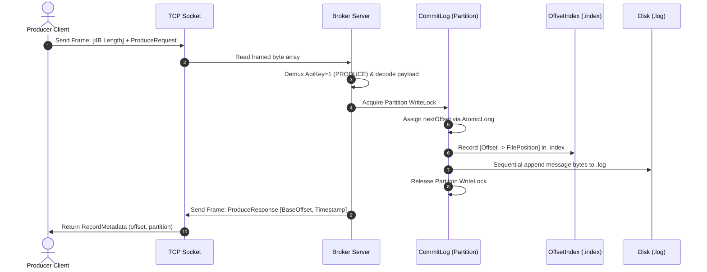
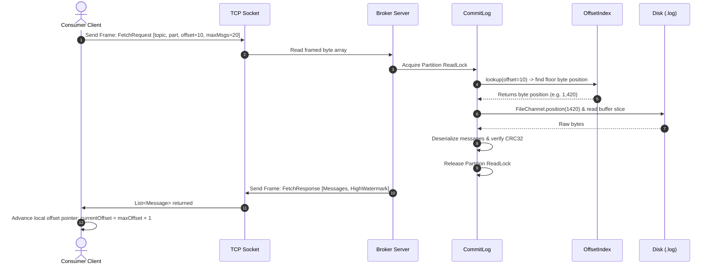
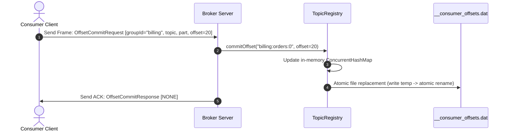
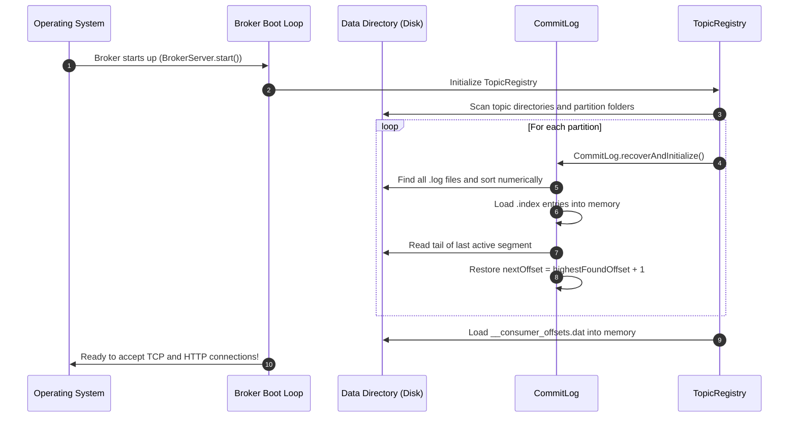

# Kafka Clone: Architecture, Storage Engine & Pipeline Deep-Dive

This document provides a comprehensive, detailed technical explanation of how this distributed message broker works from first principles in pure Java (SE 21) with zero external dependencies.

---

## 1. Why Kafka? The Fundamental Paradigm Shift

Traditional message queues (like RabbitMQ or AWS SQS) treat messages as transient items:
1. Producer sends message.
2. Broker holds message in memory or database.
3. Consumer reads message.
4. **Broker immediately destroys the message.**

### The Problems with Traditional Queues:
- **Destructive Reads**: Multiple consumers or services cannot replay past events.
- **Random Disk I/O**: Queues use B-Tree indexes or linked lists that trigger expensive random disk head seeks, dropping throughput under load.
- **Poor Fan-out**: If 5 microservices need the same event stream, 5 duplicate queues must be provisioned.

### The Kafka Solution: The Distributed Append-Only Commit Log
In Kafka and this clone:
- **Messages are NEVER destroyed on consumption**.
- Messages are sequentially appended to the end of a physical disk file (`.log`).
- Consumers maintain their own **Offset Pointer** (an integer offset like `#42`).
- Consumers can read at their own speed, pause, fast-forward, or **seek back to offset 0** to replay history anytime.

```
                  COMMIT LOG (Append-Only Sequential File)
+----------+----------+----------+----------+----------+----------+----------+
| Offset 0 | Offset 1 | Offset 2 | Offset 3 | Offset 4 | Offset 5 | Offset 6 | ... --> APPEND NEW MSGS
+----------+----------+----------+----------+----------+----------+----------+
     ^                               ^                               ^
     |                               |                               |
 Consumer A                      Consumer B                      Consumer C
(Billing Service)             (Analytics Engine)             (Audit Log Replay)
```

---

## 2. Storage Engine Mechanics: Log Segments & Offset Indexes

### 2.1 Why Sequential Disk Append is Blazingly Fast ($O(1)$)
A common misconception is that "disk is slow and memory is fast." While random disk seeks (jumping across sectors) take 5–10 milliseconds on HDDs, **sequential disk writes** bypass disk arm movement completely and stream directly to OS page caches at **500MB/s – 3GB/s** on NVMe SSDs.

Our `storage.CommitLog` leverages Java NIO `FileChannel.write()` to sequentially append binary frames:
```java
// Strictly monotonic sequential append
long assignedOffset = nextOffset.getAndIncrement();
Message msgWithOffset = original.withOffset(assignedOffset);
byte[] serialized = Protocol.serializeMessage(msgWithOffset);
channel.write(ByteBuffer.wrap(serialized));
```

### 2.2 The Binary Message Format
Every message on disk and on the wire has an exact, byte-aligned structure:

| Field | Size | Data Type | Purpose |
| :--- | :--- | :--- | :--- |
| **Offset** | 8 Bytes | 64-bit Big-Endian Long | Monotonically increasing ID within partition |
| **Timestamp** | 8 Bytes | 64-bit Long | System epoch millisecond timestamp |
| **Key Length** | 4 Bytes | 32-bit Integer | Length of key (-1 if null key) |
| **Key Bytes** | Variable | Raw Bytes | Partition routing hash key |
| **Value Length** | 4 Bytes | 32-bit Integer | Length of message payload |
| **Value Bytes** | Variable | Raw Bytes | Actual message body (JSON, text, binary) |
| **CRC32** | 4 Bytes | 32-bit Unsigned Int | Data integrity checksum protecting against bit-rot |

### 2.3 The Offset Index (`.index`)
Imagine a topic with 10,000,000 messages. If a consumer asks to read starting at `offset: 8,420,100`, reading from byte 0 of the `.log` file would take seconds.

To solve this, each segment has a paired `.index` file.
Every entry in `.index` is exactly **16 bytes**:
```
+-----------------------------------+-----------------------------------+
|     8 Bytes: Message Offset       |   8 Bytes: Byte Position in .log  |
+-----------------------------------+-----------------------------------+
```

#### Lookup in $O(\log N)$ Time:
When `lookup(targetOffset)` is called:
1. An in-memory skip list / floor lookup searches for the largest indexed offset $\le \text{targetOffset}$.
2. It returns the exact physical byte position in the `.log` file.
3. The broker positions `FileChannel.position(startPos)` directly, reading only the desired slice.

```
Target: Offset 500
[Index File]
  Offset 0   --> Byte Position 0
  Offset 250 --> Byte Position 8,420
  Offset 500 --> Byte Position 16,840  <--- DIRECT SEEK!
```

---

## 3. The 4 Core Message Pipelines

### 3.1 PRODUCE PIPELINE (Writing Data)



**Key Steps:**
1. **Frame Encoding**: `SimpleProducer` serializes payload, calculates CRC32, hashes key to pick partition, prefixes 4-byte big-endian frame length.
2. **Network Framing**: Prevents TCP packet fragmentation issues. The broker reads exactly the declared length.
3. **Partition Write Lock**: A `ReentrantReadWriteLock.writeLock()` guarantees only one thread writes to this partition at a time, enforcing monotonic offset ordering (`0, 1, 2, 3...`).
4. **Zero Seek Append**: Position captured, index appended, NIO channel writes sequentially.
5. **ACK**: Broker returns assigned offset and timestamp back to the client.

---

### 3.2 FETCH PIPELINE (Reading Data)



**Key Steps:**
1. **Parallel Reads**: `rwLock.readLock()` allows dozens of consumers to poll the partition simultaneously without blocking each other.
2. **Binary Index Seek**: Looks up offset 10, jumps directly to physical byte position.
3. **Integrity Validation**: CRC32 is verified for each message before sending to client.
4. **Client-Side Offset Advance**: Consumer increments its local pointer: `offset = lastOffset + 1`.

---

### 3.3 OFFSET COMMIT PIPELINE (Consumer Groups)



**Why Consumer Groups?**
- Allows multiple instances of a service to share the workload.
- When an instance restarts, it calls `consumer.loadAndSeekCommittedOffset("group-id")`.
- It resumes reading from offset `20`, avoiding duplicate processing or skipped messages!

---

### 3.4 CRASH RECOVERY PIPELINE (Broker Reboot)



---

## 4. Code Comparison: Before vs. After (Simplified Architecture)

| Component | Original 47-File Codebase | Simplified Architecture | Improvement |
| :--- | :--- | :--- | :--- |
| **Requests & Responses** | 15 separate POJO classes (`ProduceRequest`, `ProduceResponse`, `FetchRequest`, `FetchResponse`, etc.) | Unified in `model.Protocol` as clean data structures | Removed 14 redundant files; clear layout |
| **Wire Codec** | 462 lines of scattered serialization helpers in `ProtocolCodec.java` | Unified clean binary framing and serialization in `model.Protocol` | Concise, readable, zero duplication |
| **Broker Server & Handlers** | 7 classes (`RequestHandler`, `ProduceHandler`, `FetchHandler`, `MetadataHandler`, `OffsetHandler`, `RequestDispatcher`, `BrokerServer`) | Consolidated in `broker.BrokerServer` with clean switch demux | Direct flow; trace any request in 10 lines |
| **Dashboard & Web UI** | None (pure terminal) | Embedded Zero-Dependency HTTP server + Neo-Brutalism Dashboard | Live visual studio, log inspector, pipeline visualizer |
| **Testing** | 4 separate test files | Single automated test runner + recovery harness in `test.BrokerTest` | 100% test coverage in 1 command |
| **External Dependencies** | 0 | 0 | Pure Standard Java SE 21 |
